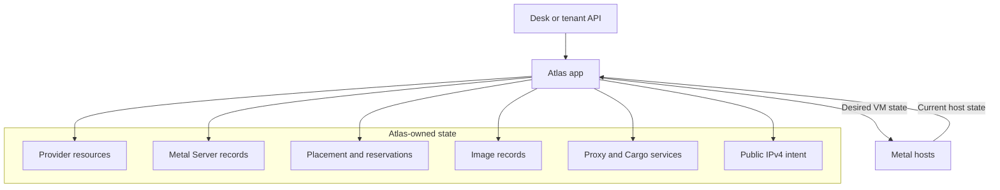
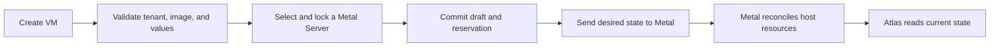

# Atlas app

The Atlas app is the control plane. It stores user intent, manages provider resources, selects Metal hosts, and presents current VM state.

Atlas is a Frappe application. Users work through Desk or the tenant API.

## What Atlas owns

Metal owns VM runtime state and host resources. Atlas reads current Metal state instead of duplicating it in DocType fields.

## Follow a VM request

The committed draft makes a lost create response safe. Atlas keeps the reservation until Metal confirms whether the VM exists.

Read [VM control plane](docs/vm-control-plane.md) for the complete placement and retry flow.

## Choose a guide

| Task | Guide |
| --- | --- |
| Create a test environment and first VM | [Getting started](docs/getting-started.md) |
| Understand VM placement and desired state | [VM control plane](docs/vm-control-plane.md) |
| Move a VM between hosts | [VM migration](docs/virtual-machine-migrations.md) |
| Provision and manage a host | [Metal Server lifecycle](docs/metal-server-lifecycle.md) |
| Build, transfer, and remove images | [Image lifecycle](docs/images.md) |
| Add or change a cloud provider | [Provider guide](docs/providers.md) |
| Understand tenant boundaries | [Tenant API](docs/tenant-api.md) and [security model](docs/security.md) |
| Investigate a failure | [Atlas operations](docs/operations.md) |
| Run tests and checks | [Atlas development](docs/development.md) |

## Module ownership

| Module | Responsibility | Detailed reference |
| --- | --- | --- |
| `atlas` | Settings, providers, DNS, TLS, and host binaries | [Settings and providers](atlas/SPEC.md) |
| `metal_server` | Provider hosts, Metal installation, and capacity | [Metal Server module](metal_server/SPEC.md) |
| `vm` | Placement, VM intent, images, and migration orchestration | [VM module](vm/SPEC.md) |
| `service` | Regional services that run on VMs | [Service module](service/SPEC.md) |
| `realtime` | Browser console WebSocket bridge | [Realtime module](realtime/SPEC.md) |

## Change boundaries

Keep DocType methods as permission and API boundaries. Put long operations in the domain object or background task that owns them.

Put provider behavior in `atlas/core/server_providers/`. Put host setup in `metal_server/core/`. Put VM orchestration in `vm/core/`.

Read the [Atlas app specification](SPEC.md) before you change a module boundary.
