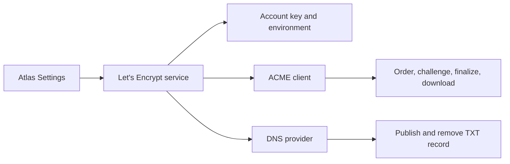
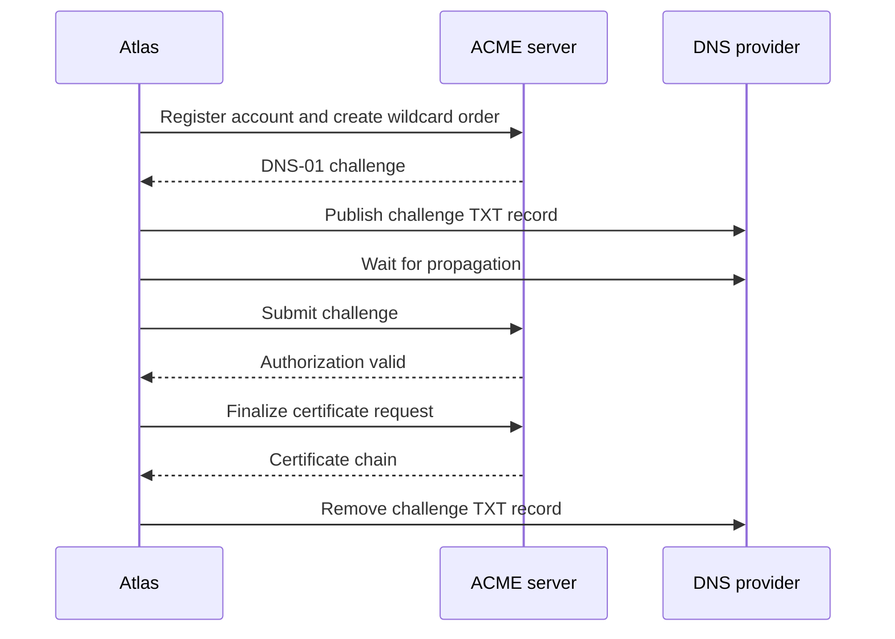

# Wildcard TLS certificate

Atlas holds one wildcard certificate for the region. A regional proxy serves every site under `*.<wildcard domain>`, so one certificate covers every site and no site needs its own issuance.

A wildcard name cannot be proved over HTTP, because there is no single host to answer for it. Only DNS can prove it. Atlas therefore uses the ACME dns-01 challenge and the DNS provider it already holds credentials for. No other challenge type is used.

## Issuance

The TXT record is removed in every case, including a failed order. A cleanup failure is logged and never hides the issuance failure.

## State

Atlas Settings owns the certificate chain, its private key, and the expiry. The chain and the key are Password fields. The expiry is read only: Atlas reads it from the certificate each time the document validates, so the 3 values cannot drift apart.

Validation refuses a certificate that does not match its private key, and one that does not cover the wildcard domain. It fails at save time and not at issuance time.

The ACME account key is the only durable local state. It stays in the Let's Encrypt configuration directory, which defaults to the `letsencrypt` folder of the site. Each ACME environment keeps its own account key, because a staging account is not a production account.

## Renewal

The Renew TLS Certificate action queues one issuance. An order waits for DNS propagation and for the ACME server, so it never runs inside a request.

Auto renew is a daily job. It queues an issuance when the certificate is absent or expires in less than 30 days. Renewal replaces the certificate and the private key together.

Use the staging environment while testing. A staging certificate is not trusted by a browser, and the staging directory has much higher rate limits than production.

## Distribution

A certificate change updates every Active Proxy Server. See the [Proxy Server specification](../service/doctype/proxy_server/SPEC.md).

## Related

- [Atlas settings SPEC](../atlas/SPEC.md) owns the settings, the provider boundary, and the TLS types.
- [providers.md](providers.md) describes the DNS provider contract that answers the challenge.
