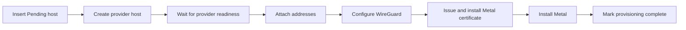

# Metal Server module specification

[Atlas app specification](../SPEC.md)

For the lifecycle overview, see [docs/metal-server-lifecycle.md](../docs/metal-server-lifecycle.md).

## Purpose

A Metal Server is a provider host where Metal runs virtual machines. This module creates it through a provider, installs Metal, and keeps its capacity current.

Provisioning is a sequence of phases, not one transaction. Each phase records progress, so a failed run resumes at the phase that failed instead of repeating work.

## Types

| Type | Owns |
|---|---|
| `MetalServer` (DocType) | Lifecycle hooks, permissions, and the whitelisted API. |
| `provisioning` | The phase order, progress saves, and failure logs. |
| `host_installation` | Installing and configuring Metal on the host. |
| `disk_inventory` | Reading block devices into Metal Server Disk rows. |
| `catalog_sync` | Refreshing Metal Server Size and Metal Server Image from the provider. |
| `host_inspection` | Inspecting and registering a Generic provider host. See [providers](../docs/providers.md#generic-provider). |
| `PublicIPPool` (DocType) | One static or provider address range and its provider attachment. |
| `PublicIPAllocation` (DocType) | One tenant prefix and its virtual machine attachment intent. |
| `PublicIPService` | Allocation, reservation, attachment, detach, and reconciliation. |
| `MetalServerUsage` (DocType) | One capacity sample reported by Metal. |

The `Metal Server` module uses [SSH Task](../atlas/doctype/ssh_task/) for host commands. The DocType belongs to the Atlas module.

## Provisioning

Manual creation and placement both insert the Pending Metal Server before its provider job starts. Every setup phase is safe to repeat. A creation retry uses the stored identity key, so a lost response cannot create a second host. A failed job sets the record to Failed.

Metal listens for the Atlas API on port 9000 and accepts only the Atlas client certificate. The provider returns an address that Metal can bind. Most providers use the endpoint from `Atlas Settings.use_public_ip_for_metald`. AWS uses the private address of the primary interface because the public address exists only in the internet gateway. Node coordination uses the WireGuard address on port 9001. Snapshot data uses port 9002. Host installation configures all three TLS paths before it starts Metal.

The provider returns the storage pool device. Host installation makes the ZFS pool from that one device and does not search for a disk.

## Certificate renewal

The node certificate is valid for 825 days. Metal reads it once at startup, so a new certificate needs a restart.

| Trigger | Result |
|---|---|
| Daily job `renew_expiring_tls_certificates` | Queues a renewal for each Running host whose stored expiry is inside 30 days. |
| Metal Server action Renew TLS Certificate | Queues one renewal for that host. |
| Host installation | Installs a current certificate before it installs Metal. |

Atlas stores the expiry in `metald_tls_expires_on` each time it issues the host certificate.

Renewal writes the new files and restarts `metal.service` when the unit is active. The unit sets `FileDescriptorStorePreserve=yes`, so the guest virtual machines stay up. A migration or console session on that host does not survive the restart. Renewal shares the Metald job lock, so it never runs at the same time as an install or an upgrade.

## Capacity

`POST /v1/sync` sends the desired host state and returns capacity in the same exchange. Atlas records the result as a Metal Server Usage row, which is what placement later reads.

The operator can set `is_sleepy_vm_host` on a Metal Server for placement strategies. Placement also sets the flag when it provisions a host for the sleepy pool. The flag is stored on the Pending record, so later placement requests reuse only a host in the same pool. It does not change host setup or capacity reporting.

A scheduled job queues one exchange for each ready server. The `sync_state` action queues one exchange for a single server, so an operator does not wait for the next scheduled run.

A transport fault and a response fault are logged separately, because they need different responses: one is a network problem, the other is a host problem.

The same exchange carries the Atlas public keys that the host must trust. Each host receives its own name as the receiver. A host that is inside the key overlap window receives the current key and the key it replaced. Atlas logs a missing signing key and syncs the host state without keys, so a capacity report never stops for it.

## Public IP allocations

Public IP pools can use static, provider direct, or routed IPv6 delivery. See [Public IP allocation](../docs/public-ip-allocation.md) for allocation, provider, validation, and replenishment behavior.

## Mesh MAC address

`private_network_mac_address` is the MAC of the private network interface. Atlas WG Mesh identifies each peer by it. Provisioning stores it once the private address is up. Each sync reports it again, and Atlas writes it only when it changes.

The `Use Unicast Networking` setting in Atlas Settings sends NDP between hosts over the IPv4 underlay. Use it when hosts share no Layer 2 network.

## Related

- [docs/metal-server-lifecycle.md](../docs/metal-server-lifecycle.md) describes the lifecycle and its reasons.
- [docs/public-ip-allocation.md](../docs/public-ip-allocation.md) describes public IP pool and allocation behavior.
- [docs/providers.md](../docs/providers.md) describes the provider contract.
- [atlas/atlas/SPEC.md](../atlas/SPEC.md) describes provider implementations and settings.
