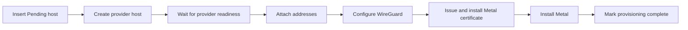

# Metal Server module specification

[Atlas app specification](../SPEC.md)

For the lifecycle overview, see [docs/metal-server-lifecycle.md](../docs/metal-server-lifecycle.md).

## Purpose

A Metal Server is a provider host where Metal runs virtual machines. This module creates it through a provider, installs Metal, and keeps its capacity current.

Provisioning is a sequence of phases, not one transaction. Each phase records progress, so a failed run resumes at the phase that failed instead of repeating work.

## Types

| Type | Owns |
|---|---|
| `MetalServer` (DocType) | Lifecycle hooks, permissions, and the whitelisted API. |
| `provisioning` | The phase order, progress saves, and failure logs. |
| `host_installation` | Installing and configuring Metal on the host. |
| `disk_inventory` | Reading block devices into Metal Server Disk rows. |
| `catalog_sync` | Refreshing Metal Server Size and Metal Server Image from the provider. |
| `host_inspection` | Inspecting and registering a Generic provider host. See [providers](../docs/providers.md#generic-provider). |
| `MetalServerIPAddress` (DocType) | One public IPv4 address or IPv6 block, and its provider intent. |
| `IPAddressService` | Tenant reservation, shared-pool claims, and release. |
| `MetalServerUsage` (DocType) | One capacity sample reported by Metal. |

The `Metal Server` module uses [SSH Task](../atlas/doctype/ssh_task/) for host commands. The DocType belongs to the Atlas module.

## Provisioning

Manual creation and placement both insert the Pending Metal Server before its provider job starts. Every setup phase is safe to repeat. A creation retry uses the stored identity key, so a lost response cannot create a second host. A failed job sets the record to Failed.

Metal listens for the Atlas API on port 9000 and accepts only the Atlas client certificate. The provider returns an address that Metal can bind. Most providers use the endpoint from `Atlas Settings.use_public_ip_for_metald`. AWS uses the private address of the primary interface because the public address exists only in the internet gateway. Node coordination uses the WireGuard address on port 9001. Snapshot data uses port 9002. Host installation configures all three TLS paths before it starts Metal.

The provider returns the storage pool device. Host installation makes the ZFS pool from that one device and does not search for a disk.

## Certificate renewal

The node certificate is valid for 825 days. Metal reads it once at startup, so a new certificate needs a restart.

| Trigger | Result |
|---|---|
| Daily job `renew_expiring_tls_certificates` | Queues a renewal for each Running host whose stored expiry is inside 30 days. |
| Metal Server action Renew TLS Certificate | Queues one renewal for that host. |
| Host installation | Installs a current certificate before it installs Metal. |

Atlas stores the expiry in `metald_tls_expires_on` each time it issues the host certificate.

Renewal writes the new files and restarts `metal.service` when the unit is active. The unit sets `FileDescriptorStorePreserve=yes`, so the guest virtual machines stay up. A migration or console session on that host does not survive the restart. Renewal shares the Metald job lock, so it never runs at the same time as an install or an upgrade.

## Capacity

`POST /v1/sync` sends the desired host state and returns capacity in the same exchange. Atlas records the result as a Metal Server Usage row, which is what placement later reads.

The operator can set `is_sleepy_vm_host` on a Metal Server for placement strategies. Placement also sets the flag when it provisions a host for the sleepy pool. The flag is stored on the Pending record, so later placement requests reuse only a host in the same pool. It does not change host setup or capacity reporting.

A scheduled job queues one exchange for each ready server. The `sync_state` action queues one exchange for a single server, so an operator does not wait for the next scheduled run.

A transport fault and a response fault are logged separately, because they need different responses: one is a network problem, the other is a host problem.

The same exchange carries the Atlas public keys that the host must trust. Each host receives its own name as the receiver. A host that is inside the key overlap window receives the current key and the key it replaced. Atlas logs a missing signing key and syncs the host state without keys, so a capacity report never stops for it.

## Public IPv4

The Public IP Pool list exposes one creation path: Generic installations add a static pool, while managed providers reserve one from their API. Provider pools expose Release Provider Pool under Dangerous Actions. Release deletes Available allocations, refuses allocations in use, and then releases the provider resource.

An address carries a desired intent and an intent version. Reconciliation applies the intent and preserves a pending one for a retry, so a failed apply is never mistaken for a completed one.

The provider attach operation returns the host address that receives public traffic. Atlas stores this value in `host_address` and then sends it to Metal. A newer intent prevents the old reconcile job from sending its value to Metal.

Detach gives the provider the stored host address and the server. This state lets a provider finish cleanup after an earlier partial operation.

An address has a tenant and a `reserved` flag. An address without a tenant is in the shared pool. `IPAddressService` owns both fields.

A tenant reservation claims an address from the shared pool. An operator fills the pool from the provider. An empty pool is an error. A claim locks the row before it writes the tenant and flag. Release clears both fields, keeps the provider reservation, and refuses attached or detaching addresses.

A virtual machine can attach an address that its own tenant holds, or an unowned address from the shared pool. Attaching an unowned address claims it for the tenant of the virtual machine but does not reserve it. An address that another tenant holds is refused. The attach route accepts `auto` and borrows the oldest free pool address.

Attachment changes lock the virtual machine, and a named reservation is checked after its allocation row is locked. This preserves one allocation of each IP version per VM during concurrent requests.

An unreserved address returns to the shared pool after detach, including VM deletion. The guarded update clears the tenant only after provider detach succeeds. A reserved address keeps its tenant until release.

A tenant can reserve an address it already holds to stop that return, even while it is attached. A `Detaching` address is refused because reconciliation has already decided its pool return.

Reset Tenant returns one unattached address to the shared pool. It needs the System Manager role, refuses unowned addresses, and records the previous tenant in a comment.

Remove deletes one unattached address and releases its provider reservation. It uses the standard delete permission and confirmation. Both actions appear only for an unused Allocated address.

An IPv4 record is one `/32` address, and validation refuses any other length. The provider maps it to a host address, and Metal sends its traffic to one VM. Atlas has no IPv4 blocks.

## Public IPv6 blocks

A record with `version` 6 is one IPv6 block. `cidr` holds its length, which the provider sets: `/64` on Scaleway and `/80` on AWS. An operator sets it on a Generic network. A block never joins the shared pool, and a tenant cannot reserve it.

A pool assigned to an IPv6 Router Server cannot be deleted until the router is archived.

A System Manager attaches one block to one VM from the VM form or the block form. Both paths run the VM network checks. Atlas sends `public_ipv6` to Metal first, then sets the attach intent. The host routes the whole block into the VM and answers neighbour solicitations for it on its public interface.

On AWS, a reservation picks the first free `/80` of the Atlas subnet. Attach delegates it to the host interface, and detach takes it back.

VM termination releases every address of the VM. A migration moves each attached address to the destination server at cutover. A failed move is logged and does not stop the others.

## Mesh MAC address

`private_network_mac_address` is the MAC of the private network interface. Atlas WG Mesh identifies each peer by it. Provisioning stores it once the private address is up. Each sync reports it again, and Atlas writes it only when it changes.

The `Use Unicast Networking` setting in Atlas Settings sends NDP between hosts over the IPv4 underlay. Use it when hosts share no Layer 2 network.

## Related

- [docs/metal-server-lifecycle.md](../docs/metal-server-lifecycle.md) describes the lifecycle and its reasons.
- [docs/providers.md](../docs/providers.md) describes the provider contract.
- [atlas/atlas/SPEC.md](../atlas/SPEC.md) describes provider implementations and settings.
