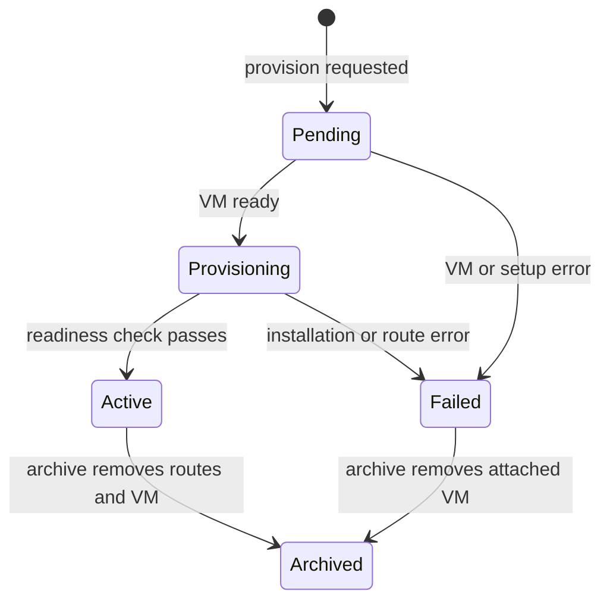

# Cargo Server specification

[Service module specification](../../SPEC.md)

## Purpose

Cargo Server is a Single DocType that owns the regional Cargo service and its virtual machine.

## Lifecycle

Provision is available only in Not Provisioned or Archived status when no virtual machine is attached. A Failed service must be archived before another provision request.

Atlas uses a site-scoped file lock for Provision, Archive, and installation. It reads the Single DocType again while the lock is active. This prevents concurrent lifecycle actions and duplicate virtual machines.

A draft virtual machine keeps the service Pending. Atlas queues the same service every minute until virtual machine reconciliation completes. A known create fault changes the status to Failed. Atlas does not create a replacement automatically.

Archive removes both Proxy routes before it requests virtual machine termination. After Atlas accepts the termination request, Cargo Server clears the virtual machine and installation task links and sets Archived. Metal completes virtual machine deletion independently.

## Virtual machine

Provision requires an Active Proxy Server, an enabled Available System image, and an unattached reserved tenant-0 Public IP Allocation for IPv4. Atlas creates the virtual machine for tenant `0` with privileged mesh access, the default `0.0.0.0/0` route via `host`, hostname `cargo`, and the Atlas public SSH key.

The public IPv4 address is for SSH and operations. The Cargo and Pilot HTTP routes always use the virtual machine WireGuard mesh IPv6 address.

## Installation

Atlas waits for root SSH on the public IPv4 address and runs `atlas/scripts/install-cargo.sh` with a synchronous SSH Task. Cargo Server links to this task so that an operator can read its status and output while the virtual machine exists.

The provision request also carries the default storage cluster: `storage_node_count`, `replication_factor`, and a `gateway` and `storage` block of `cpu`, `ram_gb`, and `disk_gb`. Atlas rejects a value below 1 and a `storage_node_count` below the `replication_factor`. Atlas writes the accepted request to `private/files/cargo-storage-cluster.json` and reads it again at installation, because the installation job runs after the dialog closes. Archive removes the file.

Atlas creates the Atlas token, Proxy token, Cargo site password, and Pilot admin password immediately before installation. Atlas sets the Pilot administration domain to `cargo-pilot.<wildcard-domain>`. The installation environment supplies every variable in the `ENROLMENT_VARS` list of the script, and `DEFAULT_STORAGE_CLUSTER_CONFIG` with the stored cluster as compact JSON. A test compares the two lists. The script writes the cluster to the site configuration key `default_storage_cluster_config` with `set-config -p`, so Cargo reads it as JSON and builds the cluster on first boot. The SSH Task stores the installer environment and output for operator visibility.

The Atlas token has audience `atlas-admin:<region-id>`, subject `cargo`, scope `*`, tenant `0`, and a 365-day lifetime. The Proxy token has audience `atlas-proxy:<region-id>`, subject `cargo`, scope `site:*`, a site suffix constraint of `-svc`, no tenant claim, and a 365-day lifetime.

## Proxy route

Atlas sends `PATCH /v1/sites/cargo` and `PATCH /v1/sites/cargo-pilot` to `https://proxy.<wildcard-domain>` with the regional Proxy password. Both request bodies contain the virtual machine mesh IPv6 address. Atlas does not create direct A records for these domains. The existing wildcard DNS record sends public traffic to the Proxy cluster.

Atlas sets the service to Active only after `https://cargo.<wildcard-domain>/api/method/ping` returns HTTP 200 with `pong`.

## Object storage bucket

After Cargo Server becomes Active, Atlas queues bucket creation. A scheduled job repeats it every minute while Atlas has no object storage and Cargo Server is Active.

The job stops quietly until `https://s3-admin-svc.<wildcard-domain>/health` answers. Garage serves this route through the Proxy after Cargo activates its object storage cluster. Atlas then sends `POST /api/method/cargo.object_storage.api.bucket.create_bucket` to `https://cargo.<wildcard-domain>` with the bucket name `atlas-<region-name>` and this region name. The request carries a 5-minute token in the `X-Cargo-Access-Token` header with audience `atlas-cargo:<region-id>`, subject `atlas`, scope `*`, and tenant `0`.

Cargo returns the secret key one time and keeps no copy. Atlas writes the bucket, endpoint `https://s3-svc.<wildcard-domain>`, region, and both credentials to Atlas Settings, then commits. This save starts the pending bootstrap image migrations.

Atlas never replaces object storage that is already configured. A second attempt writes an Error Log entry instead, because a replaced key makes the objects under the current bucket unreachable. Clear the Atlas Settings object storage fields to provision another bucket.

After the bucket exists and each available bootstrap image has moved from Site File storage to Object Storage, Atlas enables the Cargo Pilot release tracker. Cargo then builds images for new Pilot prereleases. Cargo Server records this state in Auto Build Pilot Images. System Managers can enable or disable the tracker from Actions after Cargo Server becomes Active.

## Access and failures

Only System Managers with System User accounts can operate Cargo Server. An Active Cargo Server has a Reset Pilot Admin Password action. Atlas generates a password, runs `pilot set-admin-password` through SSH as the Cargo bench user, and shows the password once after a successful command. Atlas does not store the reset password or command output.

Atlas stores the failed phase and the failure message. The phase is one of `secure-shell`, `installation`, `proxy-routes`, `readiness`, `virtual-machine`, or `archive`. System Managers can read the installation secrets and output in the linked SSH Task.

Use [Cargo Server operations](../../../docs/cargo-server.md) for the operator workflow. Use [Proxy control daemon](../../../../services/http-proxy/docs/control-daemon.md) for the site map interface.
