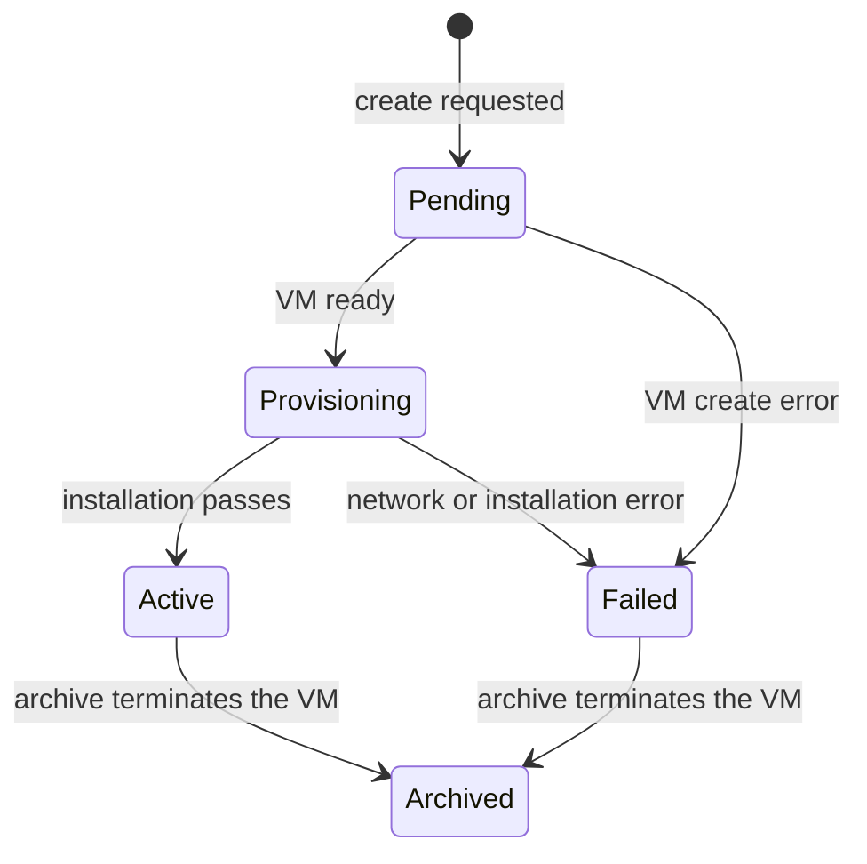

# IPv6 Router Server specification

[Service module specification](../../SPEC.md)

## Purpose

Each IPv6 Router Server owns one [IPv6 router](../../../../services/ipv6-router/README.md) and its virtual machine.

One Public IP Pool links to the router through its `gateway` field.

A region can have multiple routers and routed IPv6 pools.

Atlas names each record `ipv6-router-NNN`.

## Lifecycle

Create the router from the IPv6 Router Server list.

Creation needs an enabled Available System image, a reserved tenant-0 IPv4 allocation, and an IPv6 pool without a gateway or allocations.

The IPv6 pool must have a prefix length of `/84` or shorter.

Atlas sets its allocation size to `/128` and links it to the new router.

Atlas creates the VM for tenant `0` with privileged mesh access, `uplink` egress, the record name as its hostname, and the Atlas public Secure Shell key.

The router does not need a Proxy Server.

Atlas uses one site file lock for each router during archive and installation.

A draft VM keeps the router Pending.

Atlas retries Pending and interrupted Provisioning records every minute.

The network step waits until Metal has attached the public IPv4 allocation.

## Installation

| Phase | Action |
| --- | --- |
| `network` | Make the VM a network gateway and attach the complete IPv6 pool. |
| `secure-shell` | Wait for root Secure Shell access on the public IPv4 address. |
| `installation` | Install the IPv6 router with `REGION_ID` and `PUBLIC_IPV6_PREFIX`. |

The installer fails when the eBPF program is not attached.

A failure sets the status to Failed and stores the phase and message.

## Routed IPv6

An automatic routed IPv6 request selects an enabled pool with an Active gateway.

Atlas first tries a gateway on the same Metal Server as the target VM.

If no local gateway has capacity, Atlas selects a random active gateway in the region.

Atlas derives a `/128` address from the pool and the VM WireGuard mesh IPv6 address.

It sets the VM route for `2000::/3` to the gateway mesh IPv6 address and keeps unrelated gateway routes.

The application VM does not hold the public prefix directly.

Tenants cannot reserve a routed IPv6 address.

After detach, Atlas deletes the routed allocation.

A later attach can give the VM a different address.

The VM firewall controls inbound traffic.

## Archive

Archive is refused while the pool has tenant-owned allocations.

After the allocations are detached, archive detaches the provider pool, terminates the router VM, and clears the pool gateway.

The record stays with status Archived.

The pool can then use a replacement router.

## Access

Only System Managers with System User accounts can create or archive a router.
