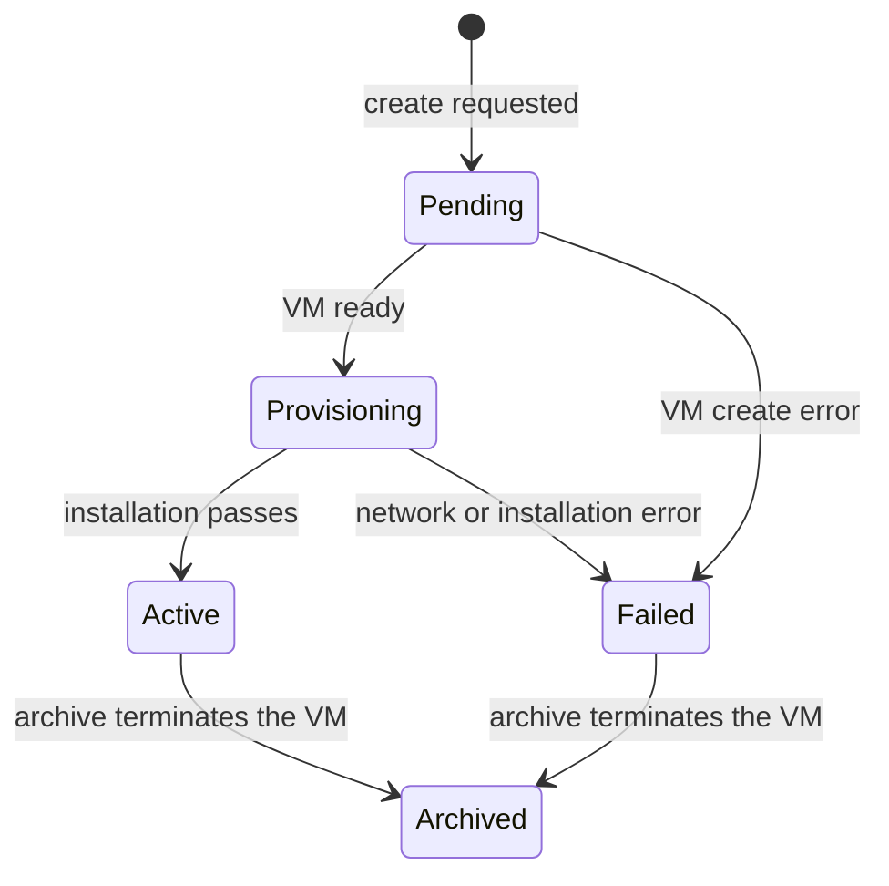

# IPv6 Router Server specification

[Service module specification](../../SPEC.md)

## Purpose

Each IPv6 Router Server record owns one [IPv6 router](../../../../services/ipv6-router/README.md), its virtual machine, and one public IPv6 block. A region can have many routers. Atlas names each record `ipv6-router-NNN`.

## Lifecycle

Create the router from the IPv6 Router Server list. Creation needs an enabled Available System image, an Allocated public IPv4 address, and an Allocated IPv6 block. Both addresses must be free and belong to the shared pool (`tenant_id` -1) or to tenant `0`. The block must be `/84` or larger. Each block belongs to one router.

Atlas creates the VM for tenant `0` with the privileged flag, `uplink` egress, the record name as hostname, and the Atlas public SSH key. It does not need a Proxy Server.

Atlas uses one site file lock for each router during Archive and installation. A draft VM keeps the record Pending. Atlas queues each Pending record every minute until VM reconciliation completes. It also resumes an interrupted Provisioning record. The network step waits until Metal holds the public IPv4 address, because it replaces the complete Metal network.

## Installation

| Phase | Action |
| --- | --- |
| `network` | Make the VM a network gateway, then attach the IPv6 block. |
| `secure-shell` | Wait for root SSH on the public IPv4 address. |
| `installation` | Run `install-service-package.sh` with the IPv6 router package, `REGION_ID`, and `PUBLIC_IPV6_PREFIX` in a synchronous SSH Task. |

The installer fails when the eBPF program is not attached. A failure sets Failed and stores the phase and the message.

## Routed IPv6 on a VM

The Virtual Machine form has **Attach Routed IPv6** and **Detach Routed IPv6** in Actions.

Attach asks for an Active IPv6 Router Server. It sets the gateway route `2000::/3` to that router VM, replaces an earlier `2000::/3` route, and keeps the other gateway routes. It returns the public address from the block of that router. The Routed IPv6 field shows the address while the route exists. Atlas finds the router from the gateway of the `2000::/3` route.

Attach fails in these conditions:

- The selected router is not Active.
- The tenant ID or the VM number does not fit the public layout.
- The VM is a network gateway or holds its own IPv6 block.

The VM firewall controls inbound traffic.

## Archive

Archive terminates the router VM. Termination releases the IPv6 block and the IPv4 address. The record stays with status Archived. VMs that route through this router lose their public IPv6 path. Detach their routed IPv6 before you archive.

## Access

Only System Managers with System User accounts can create or archive a router.
