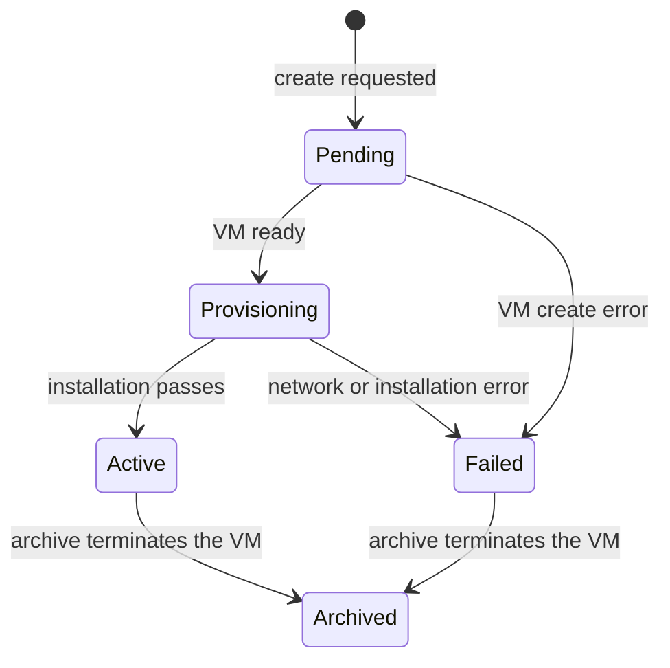

# WireGuard Gateway Server specification

[Service module specification](../../SPEC.md)

## Purpose

Each WireGuard Gateway Server owns one [WireGuard gateway](../../../../services/wg-gateway/README.md)
and its virtual machine. Customers reach their own tenant's private `fdaa`
VMs through the gateway over WireGuard. Access is tenant-wide.

Atlas names each record `wg-gateway-NNN`. Peers are `WireGuard Gateway Peer`
records named `wg-peer-NNN`.

## Lifecycle

Create the gateway from the WireGuard Gateway Server list.

Creation needs an enabled Available System image, a reserved tenant-0 IPv4
allocation, and a listen port. The gateway endpoint is that IPv4 address and
port. Atlas creates the VM for tenant `0` with privileged mesh access, the
default `0.0.0.0/0` route via `host`, the record name as its hostname, and
the Atlas public Secure Shell key. Privilege permits cross-tenant mesh
delivery; the gateway role is not needed, because the gateway SNATs every
forwarded packet to its own mesh address.

The port is set once. A draft VM keeps the gateway Pending.

Atlas retries Pending and interrupted Provisioning records every minute.

Provisioning waits until Metal has attached the public IPv4 allocation.

## Installation

| Phase | Action |
| --- | --- |
| `secure-shell` | Wait for root Secure Shell access on the public IPv4 address. |
| `installation` | Install WireGuard and nftables with `GATEWAY_MESH` and `LISTEN_PORT`, then read the gateway public key. |

The installer generates the gateway keypair on the VM and keeps it on
reinstalls. A failure sets the status to Failed and stores the phase and
message.

## Peers

Central manages peers through the WireGuard Gateway API: `add_peer`,
`delete_peer`, `list_peers`, `replace_peer_list`, and `get_wireguard_config`.
`add_peer` takes the Central-provided `public_key`, `tenant_id`, and
`client_id` and returns the assigned `fdac` address. Tenant and client IDs
are integers from 1 to 2^32-1; the client ID is the low 32 bits of the
`fdac` address. Atlas is the source of truth: every change rewrites `peers.conf` and `gateway.nft` on the gateway
and applies them with `wg setconf` and `nft -f`.

A reboot reapplies both files from disk through
`atlas-wg-gateway.service`. Use Sync Peers to push the desired state again.

Tenants cannot reserve anything here. After delete, the peer row is gone.

The VM firewall stays disabled on the gateway, so handshake and tunnel
packets pass. Tenant isolation is the nftables tenant-wide rule; VM-level
firewalling stays with each VM.

## Archive

Archive is refused while the gateway has peers. After the peers are deleted,
archive terminates the gateway VM. The record stays with status Archived.

## Access

Only System Managers with System User accounts can create, archive, sync, or
manage peers.
