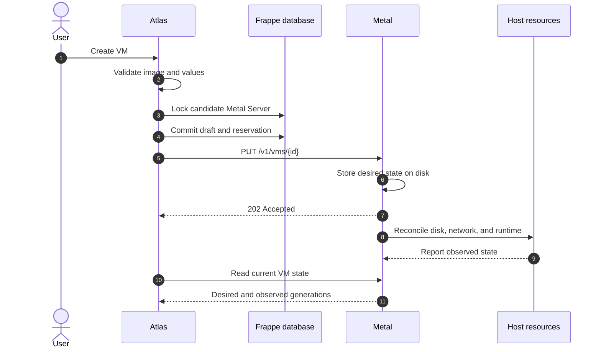
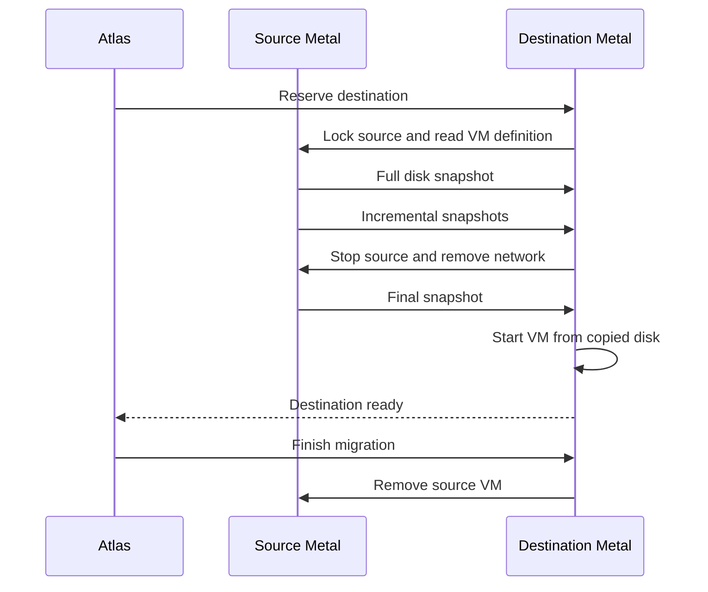

# How Atlas works

Atlas is the virtual machine control system for Frappe Cloud. It has 4 main components with clear ownership boundaries.

Read this page first. It explains how a user request becomes a running Firecracker virtual machine.

## The system at a glance

Atlas decides what must exist. Metal makes one host match that decision. The proxy and WG Mesh carry traffic to the VM.

| Path | Flow | Purpose |
| --- | --- | --- |
| VM control | User → Atlas → Metal → Firecracker | Create, update, start, stop, and delete a VM. |
| Public traffic | Internet → HTTP proxy → VM | Route a site or custom domain to its VM. |
| Private traffic | VM → WG Mesh → VM | Carry private packets between VMs on different hosts. |
| Storage | Object storage → Metal cache → ZFS disk | Create VM disks and transfer images or snapshots. |

## Why Atlas and Metal are separate

Atlas owns user intent and provider resources. Metal owns host state and VM resources.

This split lets each component recover from its own durable state. A Metal restart does not stop a VM. An Atlas outage does not erase host intent.

| Owner | Durable responsibility |
| --- | --- |
| Atlas | Provider resources, Metal Server records, placement, image records, public IPv4 intent |
| Metal | Desired VM state, observed VM state, reservations, and cleanup progress |
| systemd | One Firecracker process for each running VM |
| ZFS | Base images, VM disks, snapshots, and migration staging data |
| HTTP proxy | Regional site routes, custom domains, and route generations |
| WG Mesh | Private VM location and packet forwarding between hosts |

::: info Desired and observed state
Desired state describes what Atlas wants. Observed state describes what Metal currently sees on the host.
:::

Atlas reads current Metal state when it needs it. Atlas does not copy changing runtime state into durable DocType fields.

## How a VM is created

Atlas commits a draft before it calls Metal. The draft reserves capacity and gives the request a stable VM ID.

If the create response is lost, Atlas keeps the draft. It reads Metal before it retries or removes the draft.

Read [VM control plane](../atlas/docs/vm-control-plane.md) for placement, reservations, and retry rules.

## How a Metal Server is provisioned

Atlas creates provider resources in a background job. Each completed phase stores its progress before the next external action starts.

1. Atlas validates the provider settings and server catalog.
2. Atlas creates a pending Metal Server record.
3. Atlas creates or reuses the provider host.
4. Atlas configures public addresses and the private network.
5. Atlas configures WireGuard and issues the Metal certificate.
6. Atlas installs Metal and marks the server as running.

A retry uses the stable Metal Server identity. Atlas removes a provider host only when the current request created that host.

Read [Metal Server lifecycle](../atlas/docs/metal-server-lifecycle.md) for phase ownership and failure recovery.

## How placement uses capacity

Metal reports a capacity sample to Atlas. Atlas accepts a sample that is less than 2 minutes old.

| Check | Why Atlas needs it | Result on failure |
| --- | --- | --- |
| The image architecture matches the host | Firecracker must use a compatible kernel and root disk. | Skip the host. |
| The capacity sample is less than 2 minutes old | Old data can cause unsafe placement. | Skip the host. |
| Memory and storage remain after recent reservations | Concurrent requests must not reserve the same capacity. | Skip the host. |
| Capacity still fits after Atlas locks the server row | Placement must use one final serialized check. | Select another host. |

CPU entitlement can exceed physical CPU capacity. Memory and storage must be available when Atlas selects the host.

## How images and snapshots move

Atlas owns image records and object storage. Metal owns local images, VM disks, and snapshot staging data.

| Operation | Source | Destination |
| --- | --- | --- |
| Prepare a VM disk | Object storage | Metal image cache, then a ZFS clone |
| Create an image | VM disk | Metal staging, then object storage |
| Register an image | Uploaded object | Atlas Machine Image record |

Warm Firecracker state stays on one host. Atlas uploads the disk and kernel, but it does not upload guest memory.

Read [Image lifecycle](../atlas/docs/images.md) for cache policy, image transfer, and deletion.

## How a VM moves to another host

Migration copies the disk while the source VM runs. Metal then stops the source, copies the final delta, and starts the destination.

Read [VM migration](../atlas/docs/virtual-machine-migrations.md) for checkpoints, rollback, and failure scenarios.

## Where failures stop

Each component keeps failures inside its ownership boundary.

| Failure | What remains safe | Where to investigate |
| --- | --- | --- |
| Provider request fails | Metal host state does not change | Atlas Error Log and Metal Server setup phase |
| Atlas cannot reach Metal | Atlas keeps the draft or intent | Atlas operations and Metal health |
| VM runtime fails | Metal keeps desired state and error data | Metal observed state and systemd |
| Cleanup step fails | Metal keeps cleanup progress | Metal VM status record |
| Proxy node fails | VM lifecycle state does not change | Proxy readiness, leader, and DNS |
| WG Mesh fails | VM and Metal records remain valid | Mesh maps, discovery, and WireGuard |

Start with the [operations guide](operations.md) when you do not know which component owns a failure.

## Go deeper

- [Atlas app](../atlas/) explains the control plane and its modules.
- [Metal architecture](../metal/docs/architecture.md) explains host reconciliation and runtime ownership.
- [HTTP proxy](../services/http-proxy/) explains public traffic and route replication.
- [WG Mesh design](../services/wg-mesh/docs/design.md) explains private packet paths and discovery scenarios.
- [Metal API contract](metal-v1-contract.md) defines the Atlas-to-Metal interface.
