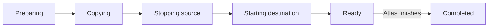

# Metal migration engine

Destination Metal drives the transfer after the Atlas app reserves a host. The Atlas app owns regional assignment and decides when to finish or abort.

## Transfer phases

| Host | Saved state |
| --- | --- |
| Destination | Migration record, reserved VM ID, and checked capacity based on the source definition. |
| Source | Lock that blocks normal VM changes. |

Normal get and list operations hide the incoming destination VM while the reservation is active, including `ready`.



The diagram shows the successful path. An abort before completion enters rollback and ends as `aborted` only after cleanup succeeds. A copy, cutover, or start fault can end as `failed`. The durable record has smaller checkpoints within each phase. A failed rollback keeps both records and locks for inspection.

## Copy the disk

1. Copy a full ZFS snapshot, then incremental changes.
2. Stop the source and remove its network before the final snapshot.
3. Receive and verify the final disk state.
4. Create the destination network and apply the source's desired power state.

A stopped VM remains stopped. Saved guest memory does not cross hosts.

Control calls use the node mutual-TLS listener. Disk bytes use a separate one-shot TLS stream on port `9002`:

```text
Source zfs send -> Go TLS connection -> Destination zfs receive
```

The destination verifies the snapshot GUID and can resume an interrupted receive.

## Finish or abort

The destination stays ready until the Atlas app decides:

- **Finish:** destroy the stopped source and remove transfer data after regional assignment changes.
- **Abort:** remove destination resources and cold-start the source if needed.

An unfinished record on either host means recovery is not complete.

## Limits and recovery

The source allows one outbound snapshot stream at a time because streams use a fixed port. A cutover or rollback fault can keep both hosts locked. Migration needs free destination storage and a reachable private host network.

| Saved work | Recovery bound |
| --- | --- |
| Destination reservation still preparing | Expires after 10 minutes without source preparation. |
| Active source or destination record | Can expire after 15 minutes without controller contact, only while recovery is safe. A stopped source or ready destination does not expire. |
| Snapshot listener with no connection or progress | Closes after 2 minutes. |

These timers release abandoned work. They do not unlock a stopped source or discard a ready destination. Keep the records when cutover or rollback needs an operator.

For API operations and schemas, use the [Metal API reference](/api/metal/). The Atlas-side decision and regional commit belong to Atlas, not this page.

::: details Source code and tests

- [Migration specification](../../metal/internal/vm/migration/SPEC.md) defines the detailed source and destination checkpoints.
- [Migration manager](../../metal/internal/vm/migration/manager.go) owns records, locks, finish, and abort.
- [Destination flow](../../metal/internal/vm/migration/destination.go) checks capacity and applies state.
- [Transfer flow](../../metal/internal/vm/migration/transfer.go) drives snapshot intervals.
- [ZFS TLS stream](../../metal/internal/storage/migration_transfer.go) moves and checks disk snapshots.
- [Migration tests](../../metal/internal/vm/migration/destination_test.go) and [stream tests](../../metal/internal/storage/migration_transfer_test.go) check recovery paths.

:::
