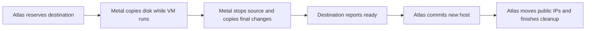

# Move a VM between hosts

Atlas picks the new host. Metal on the new host copies the disk from the old host. **The VM belongs to the new host only after Atlas records the move.** Migration can stop a running VM. Saved checkpoints let Atlas and Metal continue or roll back after a restart.

## Start a migration

1. Open **Dangerous Actions → Migrate VM** on the Virtual Machine form.
2. Select a destination Metal Server, or leave it empty for automatic placement.
3. Follow the new migration record.

Atlas excludes the source host and checks destination capacity. Desk users cannot create or edit migration records directly.

A stopped VM also moves when a resize does not fit on its host. The migration stores `target_cpu_millicores`, `target_memory_mib`, and `target_disk_mib`, and commits the new host and shape together. On failure, the VM keeps its old host and shape. The tenant API reports `migrating` during the move.

## Migration sequence

Metal copies a full ZFS snapshot, then smaller changes while the VM runs. It starts cutover when the change is below `migration.final_delta_mib`, after 16 intervals, or after 30 minutes. Cutover removes the source network, stops the source, and copies the final change. Saved guest memory does not move.

| Source state | Destination state |
| --- | --- |
| Running | Boots from the copied disk. |
| Stopped | Stays stopped. |
| Paused | Cold-boots, then pauses. |

### The commit point

Atlas keeps the source host as the VM's recorded owner until the destination reports `ready`. Before that point, a failed move can still return to the source without changing the regional assignment. After the commit, Atlas retries public IP moves and asks Metal to remove the old VM.

1. Destination Metal reports `ready`.
2. Atlas commits the new host and resize values in one transaction.
3. Atlas requests public IP moves. A failed move retries on its own schedule. It does not undo the host change.
4. Atlas asks Metal to finish, which removes the stopped source.

Metal hides the incoming VM from normal reads until the move finishes.

## Migration status

| Status | Meaning |
| --- | --- |
| `scheduled` | Waiting for an eligible destination. |
| `preparing` | Destination reserved. Source preparation in progress. |
| `copying` | Full and incremental disk copies in progress. |
| `cutting_over` | Source stops. Final copy in progress. |
| `starting` | Destination VM starts. |
| `finalizing` | Atlas changes the host. Metal removes the source. |
| `canceling` | Destination cleanup and source recovery in progress. |
| `completed` | Destination owns the VM. |
| `failed` | Cannot continue automatically. |
| `aborted` | Operator cancellation and rollback completed. |

`progress_percent` estimates the whole lifecycle, not copied bytes. Use the transfer rows for copied MiB.

## Failure and recovery

| Event | Behavior |
| --- | --- |
| Uncertain response | Retry with the same migration ID. Atlas polls Metal and records progress. |
| Abort before source stop | Removes destination data and unlocks the source. |
| Abort after source stop | Cold-starts the source before unlocking it. |
| Finish | Valid only after `ready`. The first finish or abort wins. |
| Network interruption | Resumes the saved snapshot sequence. |
| Snapshot identity mismatch | Fails the migration and keeps data for inspection. |
| Cutover or rollback fault | Keeps both hosts locked and preserves snapshots. |

**Keep unfinished migration records** on both hosts and in Atlas. Their status and saved public IP requests can differ during recovery. The [migration engine](migration-engine.md) describes Metal's checkpoints.

::: details Source code and tests

- [Atlas migration service](../../atlas/vm/core/vm_migration.py) selects, polls, commits, and finishes.
- [VM module specification](../../atlas/vm/SPEC.md) defines the `Virtual Machine Migration` record and resize rules.
- [Metal migration manager](../../metal/internal/vm/migration/manager.go) owns host records and locks.
- [Destination transfer](../../metal/internal/vm/migration/transfer.go) owns snapshot and cutover order.
- [Metal stream](../../metal/internal/storage/migration_transfer.go) carries ZFS data over TLS.
- [Public allocation service](../../atlas/metal_server/core/public_ip_service.py) moves direct addresses after commit.
- [Atlas migration tests](../../atlas/vm/core/test_vm_migration.py) and [resize tests](../../atlas/vm/core/test_vm_resize.py) check regional state and retry.

:::
