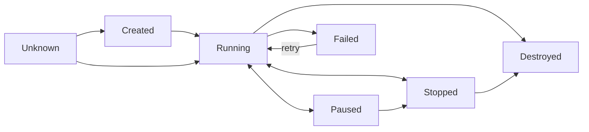

# How Metal applies VM changes

Metal saves the requested VM state before it changes host resources. A background loop applies the request and records progress. The code calls this **reconciliation**. **An accepted request means Metal saved it. The VM may still be starting.**

## Desired and observed records

| File in the VM directory | Contents |
| --- | --- |
| `config.json` | VM ID, specification, desired power state, generations, create fingerprint. |
| `status.json` | Applied generations, runtime state, phase, error, cleanup checkpoints. |

Metal writes both files before accepting a VM.

- Same ID and fingerprint: safe retry.
- Renewed signed image URL: fingerprint stays the same.
- Different request under the same ID: conflict.

## Read progress

| Marker | What it tells the Atlas app |
| --- | --- |
| Desired generation | A real requested change raises this value. |
| Observed generation | Metal applied this desired revision when the values match. |
| Specification generation | The VM shape or network specification changed. A power-only change does not raise it. |
| Restart generation | Metal accepted another explicit restart. |
| Phase and error | The host step that is in progress or failed. |

## Observed VM states

This diagram shows common observed states, not every internal phase. A failed host operation can leave an earlier observed state with an error. Read both generations and the phase before you infer what ran.

## Retry and clean up

The reconciler wakes periodically and after relevant API work. A per-VM lock serializes network, storage, runtime, and metadata changes.

Before each host call, Metal saves the phase. On failure, it records a caller-safe error and retains local diagnostics in records and logs.

Destruction saves separate runtime, network, and storage checkpoints. Later passes resume unfinished cleanup. VM records disappear only after all cleanup completes.

**Invalid records stop manager startup.** This includes corrupt data, unknown fields, unsupported schema versions, and invalid generations.

## Limits and recovery

Equal generations show that the current request was applied, but they do not replace a guest health check. An API timeout does not prove that Metal rejected a request. Read the VM again before a retry with a different specification.

For operations and schemas, use the [Metal API reference](/api/metal/).

::: details Source code and tests

- [Record store](../../metal/internal/vm/records.go) validates and atomically writes the two files.
- [VM manager](../../metal/internal/vm/manager.go) checks the create fingerprint and allocates IDs.
- [VM reconciliation](../../metal/internal/vm/reconcile.go) owns phases, errors, and cleanup checkpoints.
- [Reconciler loop](../../metal/internal/reconciler/virtual_machines.go) retries VMs with bounded workers.
- [VM manager tests](../../metal/internal/vm/manager_test.go) check retries, generations, invalid records, and cleanup.

:::
