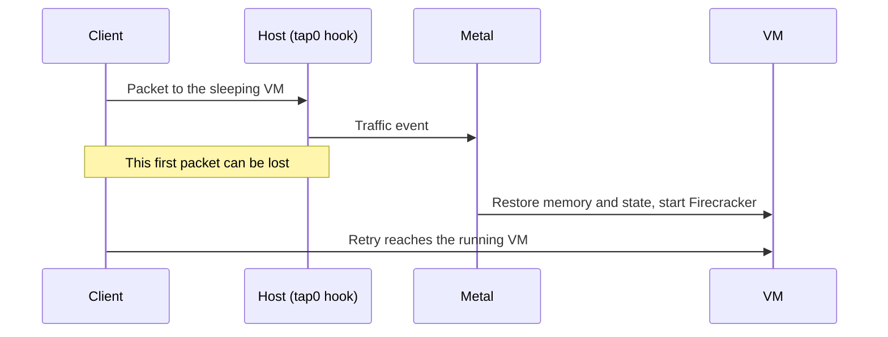

# Sleepy VMs

A **sleepy VM** is one that Metal saves and stops after an idle period. Metal restores it when new traffic arrives. While it sleeps, it uses no CPU or memory on the host, so a host can hold many more quiet VMs. It suits sites and VMs that are idle most of the day.

A VM is sleepy when `sleep_after_idle_seconds` is greater than `0`. Set it when you create the VM or with a resize. `0` turns sleeping off.

## How it sleeps and wakes

An explicit stop ends both states. Setting the timeout to `0` wakes a sleeping VM and turns sleeping off.

**Going to sleep:**

1. Metal watches traffic sent from the host to the VM.
2. Every 5 seconds, reconciliation checks running sleepy VMs with no pending change or error.
3. After the idle timeout, Metal saves memory and device state under `machines/<id>/saved-state/` and stops Firecracker.
4. Metal checks traffic again. If a packet arrived during the save, it restores the VM.

**Waking up.** An eBPF hook on the VM's `tap0` sees the next packet and tells Metal. Metal restores the saved state, and the VM carries on from where it stopped: open files and processes are intact.

Only real traffic counts: unicast IPv4 or IPv6 packets from the host to the VM. Traffic the VM sends, ARP, and IPv6 multicast chatter do not keep it awake.

## What the state looks like

| Record | While sleeping |
| --- | --- |
| Desired state | `running`. Nobody asked the VM to stop. |
| Observed state | `stopped`. Firecracker is not running. |
| Atlas list | Shows the last reported state, `stopped`. |

The saved state belongs to one VM and stays on its host. It is not the shared [warm artifact](../storage/host-storage.md#snapshots-and-warm-artifacts) that speeds up a VM's first boot.

## Placement

Sleepy VMs can live on their own hosts. With **Use Dedicated Sleepy VM Hosts** on in Atlas Settings, sleepy VMs go only to sleepy hosts, and regular VMs only to regular hosts. Auto-spawn creates a host for the right pool.

Because most sleepy VMs are asleep at any time, the `balanced` strategy divides sleepy memory by `sleepy_vm_overcommit_factor` when it ranks hosts. The capacity check still uses real free memory. `spread-3` and `best-fit` pack sleepy VMs onto the fullest sleepy host. See [placement](placement.md#strategies).

## Limits and recovery

- **The first packet can be lost** while the VM wakes. Clients must retry, as they would on any network.
- **Saved state is local.** A sleeping VM cannot move to another host with its memory. A migration cold-boots it on the new host.
- **Some actions throw the saved state away:** an explicit stop, a restart, a shape change, or deleting the VM. The next start is a normal boot.
- **A failed restore keeps the saved state** for another try. Metal never cold-boots instead, because that would lose the VM's memory without warning.
- A `metald` restart resets the idle clock, so a VM can sleep later than expected, never earlier.

To check a sleepy VM, see [Automatic idle shutdown](../operate/metal.md#automatic-idle-shutdown-does-not-stop-or-restore-a-vm) in the Metal runbook.

::: details Source code and tests

- [Idle watcher](../../metal/internal/vm/idle_watcher.go) decides when to save and when to restore.
- [Traffic monitor](../../metal/internal/network/traffic/monitor.go) and [eBPF program](../../metal/internal/network/traffic/bpf/track_traffic.c) record host-to-guest traffic.
- [Firecracker machine](../../metal/internal/firecracker/machine.go) saves and restores the VM state.
- [Placement strategies](../../atlas/vm/core/placement/strategies/balanced.py) apply the sleepy pools and overcommit factor.
- [Traffic integration tests](../../metal/internal/network/traffic/monitor_integration_test.go) exercise packet activity on Linux.

:::
