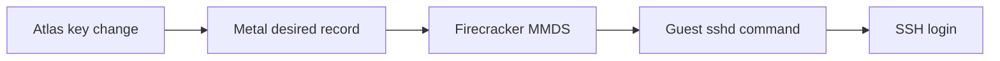

# Change a VM's SSH keys

Atlas changes a VM's SSH keys without rebuilding its image. Metal saves the complete list, then publishes it through Firecracker's microVM Metadata Service (MMDS). The guest SSH server reads it when someone logs in.

## What happens after a change

1. In the VM form, use **Edit SSH Keys** and submit the full public-key list. The API replaces the list. An empty list removes Atlas-managed keys.
2. Atlas sends that list to the VM's Metal host. Metal validates the key format, rejects duplicates, and saves the new desired record.
3. Metal tries to refresh MMDS on a running VM within a short request window. If it cannot finish then, reconciliation retries from the saved record.
4. On the next SSH login, the guest runs `AuthorizedKeysCommand` and reads `meta-data/public-keys` from MMDS. It prints the current OpenSSH keys for `sshd`.

The VM image installs `/usr/local/lib/atlas/authorized-keys-command` and sets `AuthorizedKeysCommandUser nobody`. The command gets an MMDS v2 session token, reads each key entry, and prints authorized-key lines. It does not need a guest reboot or a file rewrite when a running VM receives new keys.

::: info A stopped VM has no live metadata service
Metal still saves the requested keys while the VM is stopped. It publishes them when Firecracker starts again. Read the desired record and the VM state together before you treat an API response as proof of a live login change.
:::

## What removal does and does not do

Replacing the list removes old keys from Atlas-managed MMDS entries. It does not close an SSH session that is already open. It does not remove keys that another guest mechanism stored in `authorized_keys` files. OpenSSH checks those files before it runs `AuthorizedKeysCommand`.

The browser's [SSH console](console.md) uses a separate temporary key. Metal adds it to MMDS for one session and removes it when the session closes. Changing the VM's saved key list is a different operation.

## Check the path

If a new key fails, confirm that Metal saved the desired list, then check the VM's observed metadata phase and the guest `sshd` log. On the guest, confirm that `/etc/ssh/sshd_config.d/90-atlas-mmds.conf` names the installed command. A running VM also needs a working MMDS route at `169.254.169.254`.

For the underlying interfaces, read [Firecracker MMDS v2](https://github.com/firecracker-microvm/firecracker/blob/main/docs/mmds/mmds-user-guide.md#version-2) and the [OpenSSH `AuthorizedKeysCommand` manual](https://man.openbsd.org/sshd_config#AuthorizedKeysCommand).

::: details Source code and tests

- [Atlas VM key action](../../atlas/vm/doctype/virtual_machine/virtual_machine.py) sends the replacement list.
- [Metal key API](../../metal/internal/api/vm_ssh_keys.go) validates the complete list.
- [Metal metadata builder](../../metal/internal/vm/metadata_service.go) builds the MMDS document with `public-keys`.
- [Guest key command](../../atlas/vm/scripts/guest/authorized-keys-command) reads MMDS on SSH login.
- [Image builder](../../atlas/vm/scripts/build_ubuntu_server_image.sh) installs the SSH configuration.
- [SSH console key](../../metal/internal/firecracker/ssh.go) is temporary.

:::
