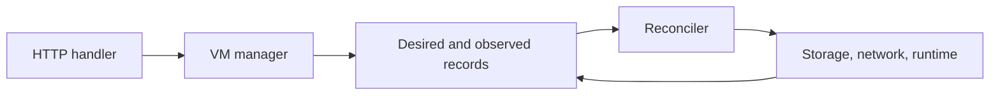

# Work on Metal

::: warning Local setup is a work in progress
The host setup and integration steps are not fully verified. Use a disposable host and ask the team if a step fails.
:::

Metal is the Go daemon on each physical host. Atlas decides where a VM belongs and sends the requested state. Metal saves that request, applies it with Firecracker, systemd, ZFS, and Linux networking, then reports what happened. Start with [how a VM request works](../start/how-a-vm-request-works.md) if this boundary is new.

## Trace one VM request



The HTTP handler checks and passes the request to the VM manager. The manager writes the desired record before Metal returns success. The reconciler then applies host work and updates the observed record. A reply can arrive before the VM is ready. [Reconciliation](../compute/reconciliation.md) explains generations, retries, and failures.

For a VM change, start in `internal/api`, then follow `internal/vm` into the package that owns the host resource. `cmd/metald` connects those packages at startup. It should not contain VM policy.

## Find the package that owns your change

| If you change... | Start here | Read |
| --- | --- | --- |
| A route or request field | `internal/api` | [Atlas to Metal rules](../interfaces/metal-contract.md), [API reference](/api/metal/) |
| VM records, generations, or cleanup | `internal/vm`, `internal/reconciler` | [Reconciliation](../compute/reconciliation.md) |
| Boot, stop, console, or Firecracker | `internal/firecracker`, `internal/console`, `internal/platform` | [Runtime](../compute/runtime.md), [console](../compute/console.md) |
| Disks, images, or snapshots | `internal/storage` | [Host storage](../storage/host-storage.md), [host layout](../storage/host-layout.md) |
| Namespaces, routes, firewall, or mesh | `internal/network` | [Host networking](../networking/host-networking.md) |
| Host inventory or capacity | `internal/host` | [Host sync](../region/host-sync.md) |
| Moving a running VM | `internal/vm/migration` | [Host migration steps](../compute/migration-engine.md) |
| Listeners, config, or worker lifetime | `cmd/metald` | [Daemon and API](../region/metald.md) |

Each package has a nearby `SPEC.md` with its code contract. The [Metal specification](../../metal/SPEC.md) has the import map. The [code map](code-map.md) links to entry files and tests.

::: info Keep the ownership boundary clear
The API handles transport, the VM manager owns requested and observed state, and host packages own their resources. Put a rule where its owner can enforce it on every retry.
:::

## Build and check a change

Run Go commands from `metal/`. The eBPF object must exist before a direct Go test because the traffic package embeds it.

```sh
cd metal
make bpf
make test
make vet
go test -race ./...
make build
```

Use `gofmt -w <changed-go-files>` after editing Go files. `make build` regenerates Swagger and builds Linux binaries. `make openapi` generates only Swagger, which Git ignores. eBPF needs Clang 12 or newer and Linux/libbpf headers. TCX traffic monitoring needs Linux 6.6 or newer.

Unit tests can run without a VM host. Boot, network, and firewall checks need host features. The [Metal host test guide](metal-testing.md) has the setup and commands. It is still a work in progress.

## Check host behavior when it matters

Test both first boot from a fresh clone and later boot from an existing disk. Shared warm memory is valid only for the first case. If your change touches lifecycle or console handling, also test explicit stop, daemon restart with console adoption, and idle save and restore.

Use a disposable host for integration work. The development script changes networking and creates a ZFS pool, systemd unit, guest image, and TLS credentials. Its file-backed pool is a development aid, not a host provisioning design.

::: details Source code and tests

- [Metal entry point](../../metal/cmd/metald/main.go) creates services and listeners.
- [VM manager](../../metal/internal/vm/manager.go) owns accepted VM changes.
- [VM reconciler](../../metal/internal/reconciler/virtual_machines.go) schedules host work.
- [Metal Makefile](../../metal/Makefile) defines generation and checks.
- [Host test guide](metal-testing.md) names integration requirements and commands.

:::
