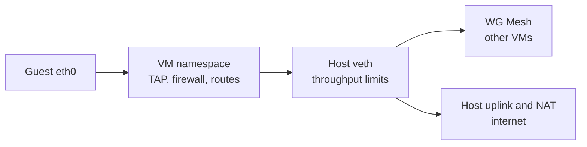

# VM networking on a Metal host

Metal creates each guest's namespace, links, routes, firewall, NAT, and throughput limits. WG Mesh forwards private traffic between hosts.

## Connect a guest to the host

Each VM has a separate Linux network namespace, so guests can reuse the same IPv4 address.

| Value | Rule |
| --- | --- |
| Guest MAC | `06:00:ac:10:00:02`, fixed so warm snapshots keep a valid MAC. |
| Transit subnet | One `/30`, derived from the VM user ID. |
| Veth names | Derived from the VM user ID. |
| MTU | `1380` on the veth and guest `eth0`. |

Metal needs no per-VM guest-address allocator. WG Mesh discovers which host owns a remote mesh address.

## Choose an outbound route

`network.routes` controls access outside the mesh. Each destination appears once. The longest prefix wins. Without routes, a VM reaches only mesh peers.

| `via` | Path | Example |
| --- | --- | --- |
| `host` | Host uplink. IPv4 uses namespace NAT. | `0.0.0.0/0` via `host` |
| Mesh address in `fdaa::/16` | Gateway VM through WG Mesh. IPv6 only. | `2000::/3` via `fdaa:1::56` |

## Attach a public address

Direct public addresses need a route via `host` for replies.

| Field | Delivery |
| --- | --- |
| `public_ipv4` | DNAT and SNAT between the public address and guest. |
| `public_ipv6` `/128` | ip6tables DNAT and SNAT to the guest mesh address. No guest configuration. |
| Larger `public_ipv6` block | Host routes the block into the VM. The guest configures addresses. |

When one VM calls another's public address, SNAT checks the original destination. The target sees the source's public address and replies through host conntrack.

This return path matters across tenants: WG Mesh would drop a direct mesh reply between them.

## Firewall rules

Metal installs namespace filtering before public or mesh attachment.

| Firewall state | Behavior |
| --- | --- |
| Disabled | Permits all traffic and retains stored rules. |
| Enabled | Permits established traffic, then checks allow rules. |
| Enabled with no rules in a direction | Blocks new traffic in that direction. |

Rules support `any`, `tcp`, `udp`, and `icmp`. Each rule has one destination port or range and canonical IPv4 or IPv6 prefixes. Each firewall allows at most **50 prefix entries**.

Changed rules apply on the next pass. Metal audits unchanged filter tables once per minute.

### How Metal applies a firewall change

1. Atlas sends the complete `firewall` value with the VM network request. Metal validates protocols, ports, and prefixes before it saves the new specification and generation.
2. Reconciliation calls `LinuxAllocator.Ensure`. It creates the namespace base, then applies the firewall **before** public addresses or mesh registration.
3. Metal renders separate IPv4 and IPv6 `filter` tables. An enabled firewall drops new forwarded traffic except for its allow rules and permits established traffic.
4. Metal replaces only a table that differs. If the second family fails, it restores the first family's old table. It checks a changed firewall at once and audits unchanged tables at least once a minute.

To change validation, start with [Metal network request validation](../../metal/internal/api/vm_request.go). For host rules, read [firewall rendering](../../metal/internal/network/firewall.go) and [network convergence](../../metal/internal/network/linux_allocator.go). Check the [unit tests](../../metal/internal/network/firewall_test.go) and [host tests](../../metal/internal/network/firewall_integration_test.go).

::: info Filter only, in the VM namespace
This firewall filters forwarded guest packets. Host public-address NAT and WG Mesh tenant isolation are separate controls. A rule that permits a packet here does not bypass those controls.
:::

## Throughput limits

Metal applies `tc` policers on the namespace end of the veth. Excess traffic is **dropped**, not queued.

Private IPv4 and IPv6 filters take priority over the public IPv4 filter. The public IPv4 limit has no effect without an IPv4 host route.

## WireGuard and mesh policy

Host sync sends the complete managed peer set. Metal applies it to `wg0`, records the applied set, and removes only peers it previously managed.

Each peer uses:

- Its mesh address as `AllowedIPs`.
- Its host's private address as the endpoint.
- A Metal-managed `/128` route through `wg0`, repaired on the next apply if missing.

`wg set` does not install these routes itself.

At startup, `metald` runs WG Mesh `configure` to install or replace its programs without interruption. VM mesh registration follows veth creation and is removed before link deletion.

Gateway VMs and VMs with public IPv6 blocks route `::/0` through the host. Tenant-0 VMs cross tenants only when host sync lists them as privileged. See [mesh gateways](wg-mesh/gateways.md).

## Guest address updates

The guest's `atlas-metadata.service` reads Firecracker's metadata service, MMDS, every **250 ms**. It reads `meta-data/mesh-ipv6` and `meta-data/host-routes`, then writes a systemd-networkd drop-in.

This updates the address after warm resume. The image contains no per-VM network values.

## Limits and recovery

- A failed step can leave partial resources. The next `Ensure` pass reads and repairs them.
- A VM can lose its first packet while it wakes from idle.
- Older images with larger MTUs may need path MTU discovery. Metal clamps TCP segment size. UDP still depends on the path.

For paths across components, read the [traffic flow](traffic.md).

::: details Source code and tests

- [Network specification](../../metal/internal/network/SPEC.md) defines host resource ownership.
- [Linux allocator](../../metal/internal/network/linux_allocator.go) sets up one VM network.
- [Routes](../../metal/internal/network/routes.go) and [firewall](../../metal/internal/network/firewall.go) apply namespace policy.
- [Traffic control](../../metal/internal/network/traffic_control.go) sets private and public policers.
- [Packet monitor](../../metal/internal/network/traffic/monitor.go) records guest-directed traffic.
- [Network tests](../../metal/internal/network/traffic_control_test.go) check the throughput filters.

:::
