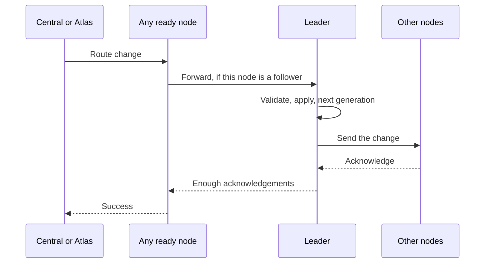

# High availability

The HTTP proxy cluster has 1 to 5 nodes in one region. Each node serves traffic from its local route map. Existing routes keep working when the cluster cannot accept a new route change. One elected leader orders changes and sends them to peers before it reports success.

Atlas manages the nodes, Domain Name System (DNS) records, peer membership, certificates, and cluster passwords. See the [control daemon guide](control-daemon.md) for the public API.

## Addresses and health

Atlas publishes node, regional, and wildcard names in that order. [Proxy provisioning](provisioning.md#which-dns-names-atlas-publishes) lists their records and TTLs. Peers use stable node addresses. Public clients use regional DNS.

Route 53 normally removes an unhealthy node from its answers. If all nodes are unhealthy, Route 53 returns all records. See [Multivalue answer routing](https://docs.aws.amazon.com/Route53/latest/DeveloperGuide/routing-policy-multivalue.html).

## State

Each node stores the site map, domain map, election term, last vote, last operation ID, and generation. The file is `/var/lib/nginx/cluster-state.json`.

The generation increases for each change. The operation ID identifies a change when 2 snapshots have the same generation.

## Leader election

A follower starts an election after its leader heartbeats stop. The election timeout is a random value from 300 ms through 450 ms.

A candidate needs a majority of votes. Each voter compares the candidate's term and generation with its local values.

The leader sends a heartbeat every 100 ms. It becomes a follower if a heartbeat response shows a higher term.

## Write path

Any ready node accepts a route change. A follower forwards the change to the leader with a 1500 ms timeout, which covers one peer repair.

The leader applies the change locally and assigns the next generation. It sends the change to all other nodes at the same time.

Each peer request has a 200 ms timeout. The leader returns success only after it receives the required acknowledgements.

A rejected change keeps the leader status, such as `409`. A follower returns `503` when it cannot reach the leader, and `502` when the cluster password fails.

| Configured nodes | Required acknowledgements | Unavailable nodes allowed |
| ---------------- | ------------------------- | ------------------------- |
| 1                | 1                         | 0                         |
| 2                | 2                         | 0                         |
| 3                | 3                         | 0                         |
| 4                | 3                         | 1                         |
| 5                | 3                         | 2                         |

The acknowledgement count includes the leader. Thus, a 5-node cluster continues to accept writes while 2 nodes are unavailable.

A successful response can leave an unavailable node behind. A later heartbeat makes that node install the leader snapshot.

A `503` response can mean that some nodes applied the change. Send the same route change again because every route change is safe to repeat.

## Node start and recovery

A node first loads its stored snapshot and applies it to OpenResty. It then asks all configured peers for their status.

The node selects the available peer with the highest generation. It downloads that snapshot when the peer generation is higher than its generation.

Atlas does not send route state to a new node.

The readiness route returns `503` until the node has synchronized and knows a leader. Atlas uses it before it publishes a new node. Route 53 checks `/healthz`, so a node can keep serving its existing maps during a write outage.

## Authentication

Peers use the regional password in `X-Atlas-Cluster-Password`. Public route clients use a Bearer password or a signed token. [Control daemon authentication](control-daemon.md#authentication) defines access rules. [proxy provisioning](provisioning.md#how-configuration-stays-current) owns password rotation.
