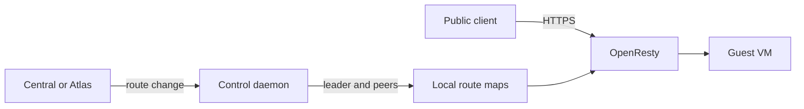

# HTTP proxy service

The HTTP proxy gives public web requests a path to tenant VMs. DNS points clients to a regional proxy node. That node looks up the requested site or domain and sends the request to the VM's stable mesh address.

WG Mesh finds the VM's current host, so moving the VM does not require a new proxy destination.

A region can have up to five proxy nodes. Each node reads a local route map to serve requests even when route writes are unavailable. The control daemon validates changes and copies them across the cluster.

| Owner | Responsibility |
| --- | --- |
| Atlas app | Proxy VMs, DNS, certificates, credentials, membership, and Cargo routes. |
| Central | Tenant site and custom-domain routes. |
| OpenResty | Public traffic forwarding from local route maps. |
| Proxy control daemon | Route validation, saved maps, and replication. |

## Two paths, one route map

OpenResty does not call the control daemon for each request. The daemon stores a snapshot and copies route changes to peers. [High availability](high-availability.md) explains leader selection and recovery.

## Route public web traffic

| Request | Path |
| --- | --- |
| Site HTTPS | Regional wildcard TLS certificate. HTTP to the guest. |
| Custom-domain HTTPS | TLS passes to the guest, which owns the certificate and accepts PROXY protocol v2. |
| Auto-proxy name | Encodes a VM address. No stored site route needed. |

Every ready node serves traffic. See [OpenResty paths](openresty.md) for routing details.

## Add a proxy node

Atlas creates the service VM, installs the package, checks readiness, then publishes regional DNS. Read [proxy provisioning](provisioning.md) for the setup, certificates, DNS, and failure steps. Use [manual installation](install.md) when you must inspect or install a node by hand.

## Store and replicate routes

`/var/lib/nginx/cluster-state.json` stores maps, election state, and generation.

The leader waits for enough node acknowledgements before it confirms a write. [High availability](high-availability.md#write-path) defines the exact counts and recovery behavior.

## Limits and recovery

An uncertain `503` can follow a partly applied change. **Retry the same route change**. Route changes are safe to repeat.

Nodes can serve existing routes without a leader or enough acknowledgements for writes. Restore cluster connectivity before expecting route changes to succeed.

**Details:** [Cluster recovery](high-availability.md), [control API](/api/http-proxy/), and [traffic paths](../traffic.md).

::: details Source code and tests

- [Proxy specification](../../../services/http-proxy/SPEC.md) defines service ownership.
- [Atlas proxy provisioner](../../../atlas/service/core/proxy/provisioning.py) owns VM package, configuration, readiness, and DNS publication.
- [Proxy cluster](../../../services/http-proxy/control/proxy_control/cluster.py) owns leader and replication behavior.
- [Proxy control routes](../../../services/http-proxy/control/proxy_control/main.py) accept map changes.
- [OpenResty guide](openresty.md) maps request types to guest paths.
- [Cluster tests](../../../services/http-proxy/control/tests/test_cluster.py) check write acknowledgements and recovery.

:::
