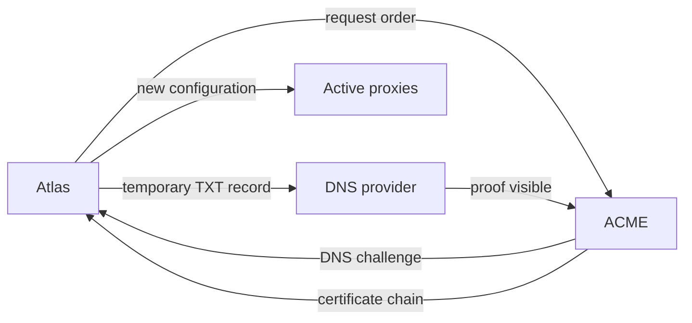

# Provision a proxy node

Atlas creates each HTTP proxy as a [service VM](../../region/service-vms.md). A region supports up to five non-archived Proxy Server records. Each record has its own VM, node DNS name, health check, package hash, and configuration hash.

## What makes a node ready

Atlas waits until the VM is no longer a draft, then runs these steps in order:

1. Check the VM and publish `proxy-NNN.<wildcard-domain>` for its public IPv4 address.
2. Wait for root SSH and install the proxy package.
3. Send configuration to the new node, then update Active peers with its membership.
4. Wait for the new node's `/readyz` response.
5. Create its `/healthz` check and publish its address in regional DNS.
6. Mark the Proxy Server `Active` and update Active nodes again.

`/readyz` is the setup gate: the node has synchronized and knows a leader. Route 53 uses `/healthz` for ongoing DNS health. A joining node restores its saved route map and catches up from the peer with the highest generation. Atlas does not send a route snapshot. See [cluster recovery](high-availability.md).

## Which DNS names Atlas publishes

| Name | Purpose | TTL |
| --- | --- | --- |
| `proxy-NNN.<wildcard-domain>` | Stable node A record for peer HTTPS and health checks. | 3600 seconds |
| `proxy.<wildcard-domain>` | One health-checked multivalue A record per node. | 120 seconds |
| `*.<wildcard-domain>` | CNAME to the regional proxy name. | 3600 seconds |

The sites API reserves `proxy` and `proxy-*`. The domains API reserves the wildcard zone and all names under it. Atlas removes a node's regional DNS, health check, and node record before it terminates the VM during archive.

## How configuration stays current

Atlas Settings owns the regional certificate and proxy password. Each node receives those values, peer membership, control names, and templates in its configuration. Atlas compares a digest on Active nodes every minute and pushes a changed configuration.

The node writes the configuration with mode `0600`, checks its certificate, reloads OpenResty, and restarts the control daemon. Proxy setup skips a package or configuration when its stored hash already matches.

Atlas rotates the regional proxy password every 12 hours. Nodes accept the previous password for ten minutes. A System Manager can also select **Rotate proxy cluster password**. Route clients can use a password or a signed token. Read [signing keys and scopes](../../interfaces/signing-keys.md) for token access.

## How wildcard TLS is issued

Atlas keeps one wildcard certificate per region. **Renew TLS Certificate** queues an ACME `dns-01` order. With automatic renewal enabled, a daily job queues renewal when the certificate is absent or expires within 30 days. Use staging ACME for tests.

Atlas tries to remove the challenge TXT record after issuance. Cleanup errors do not hide issuance errors. Atlas Settings stores the chain and private key in Password fields. Save rejects a mismatched key or a certificate outside the wildcard domain. ACME account keys live in the site's `letsencrypt` folder, one per environment.

## Failure and recovery

The Failure field names the failed step, such as `package`, `configuration`, or `control-readiness`. `Pending` setup is queued again each minute. `Failed` setup needs operator action. Correct the cause, then select **Re-provision** on the existing Proxy Server. Unchanged work can be skipped.

::: details Source code and tests

- [Proxy Server](../../../atlas/service/doctype/proxy_server/proxy_server.py) owns VM and archive actions.
- [Proxy provisioner](../../../atlas/service/core/proxy/provisioning.py) defines setup order, hashes, readiness, and DNS.
- [Proxy configuration](../../../atlas/service/core/proxy/configuration.py) builds and applies node settings.
- [Atlas Settings](../../../atlas/atlas/doctype/atlas_settings/atlas_settings.py) owns certificate and password renewal.

:::
