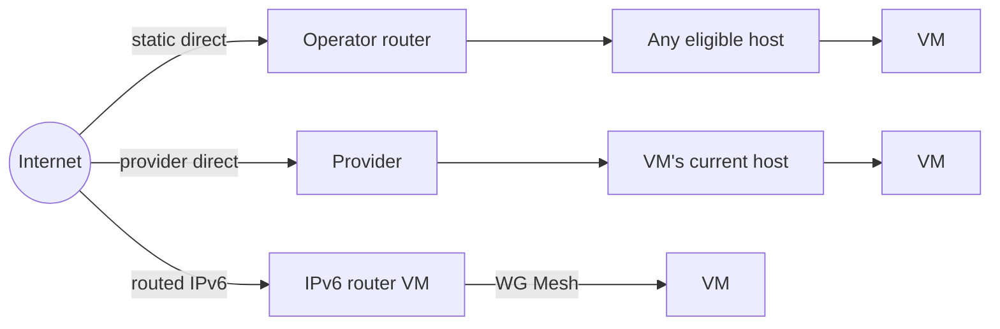

# Public IP management

A **Public IP Pool** holds address capacity. A **Public IP Allocation** assigns one prefix to a tenant or VM. The Atlas app saves the request. Metal and provider adapters apply it.

## Choose a delivery mode

| Mode | Allocation | Delivery |
| --- | --- | --- |
| Static direct | Configured prefix length. | Operator routes the pool to every eligible host. |
| Provider direct | Whole provider resource. | Provider attaches it to the VM's current host. |
| Routed IPv6 | `/128` per VM. | Router VM translates between public and mesh addresses. |

Direct pools have no gateway. Routed pools use one IPv6 Router Server. See [traffic paths](traffic.md) for packet flow.

## Static direct pools

IPv4 allocations are `/32`. IPv6 uses the configured length, such as `/128`.

Atlas checks enabled pools every minute. At **200 or fewer** available allocations, it creates up to **1,000** more. A request can also create the next allocation under the pool lock.

Atlas changes no external route. The operator must route the pool to every eligible Metal Server.

## Provider direct pools

One pool is one provider resource. Atlas never subdivides it.

| Provider | IPv4 resource | IPv6 resource |
| --- | --- | --- |
| AWS | `/32` Elastic IP mapped to a secondary private address on the host interface. | `/80` delegated to one host interface. |
| Scaleway | Flexible IPv4 address. | `/64` prefix attached to a server. |

A direct IPv6 resource belongs to one VM at a time. In routed mode, the router VM receives the whole prefix.

Atlas creates the allocation when a tenant reserves or attaches the resource. It detaches before moving a resource to another host. VM migration moves the provider address. Pool deletion releases it.

## Routed IPv6 pools

The router receives the full prefix. Each tenant VM gets a derived `/128`, so Atlas needs no address inventory.

Requirements:

- Prefix length `/84` or shorter. AWS `/80` and Scaleway `/64` qualify.
- No allocations in the pool before router creation.
- An Active router before routed automatic assignment.

**Use IPv6 Router For Auto Assignment** chooses routed or direct delivery. AWS and Scaleway setup enables it. If that mode has no capacity, Atlas does not switch modes.

A tenant can still attach a reserved direct allocation by ID.

## Allocation lifecycle

| Action | Direct allocation | Routed allocation |
| --- | --- | --- |
| Reserve | Keeps the address for a tenant. | Not supported. |
| Detach, unreserved | Returns to `Available`. | Record is deleted. |
| Detach, reserved | Returns to `Reserved` with its tenant. | Not applicable. |
| Release detached reservation | Returns to `Available`. | Not applicable. |

A routed address can change after detach and attach.

### Tenant actions

| Task | Request |
| --- | --- |
| Reserve direct IP | `POST /api/atlas/public-ips` with `{"version":4}` or `{"version":6}`. |
| Keep an attached IP after detach | `PUT /api/atlas/public-ips/{id}/reserve`. |
| Release detached reservation | `DELETE /api/atlas/public-ips/{id}`. |
| Attach or detach | VM `public-ipv4` or `public-ipv6` route. Returns `202`. |

Tenants cannot select pools or reserve routed IPv6. A System Manager uses **Reserve Allocation** on the pool form for tenant-0 service addresses.

### Pending changes

Each attach or detach increases `intent_version`, the saved request number. A background job changes the provider and Metal, then completes only that number.

An old job cannot finish a newer request. A failure keeps the request and logs the address, action, and version.

## Validation

- Pool prefixes cannot overlap. Allocations cannot overlap within a pool.
- Allocations must stay inside their pool. Pool geometry is fixed while allocations exist.
- Provider direct pools must allocate the whole resource.
- Only IPv6 pools can have a gateway. Gateway allocations are `/128`.
- VM and allocation tenants must match. A VM can hold one allocation per IP version.

Pool and allocation locks protect concurrent creation and assignment.

## Limits and recovery

Public IPv4 attachment needs `ipv4_internet_access`. Otherwise the API returns `409 ipv4_internet_access_required`.

Provider failures can leave `Attaching` or `Detaching` until a later job succeeds. Keep the latest request number and correct access to the provider or Metal. See [pending IP recovery](../operate/atlas.md#public-ip-request-stays-pending).

::: details Source code and tests

- [Public IP service](../../atlas/metal_server/core/public_ip_service.py) owns selection, attach, detach, and network changes.
- [Pool DocType](../../atlas/metal_server/doctype/public_ip_pool/public_ip_pool.py) owns range and provider resource rules.
- [Allocation DocType](../../atlas/metal_server/doctype/public_ip_allocation/public_ip_allocation.py) owns the request version.
- [IPv6 router specification](../../atlas/service/SPEC.md) explains routed allocation prerequisites.
- [Public IP tests](../../atlas/metal_server/core/test_public_ip_service.py) check allocation and network behavior.

:::
