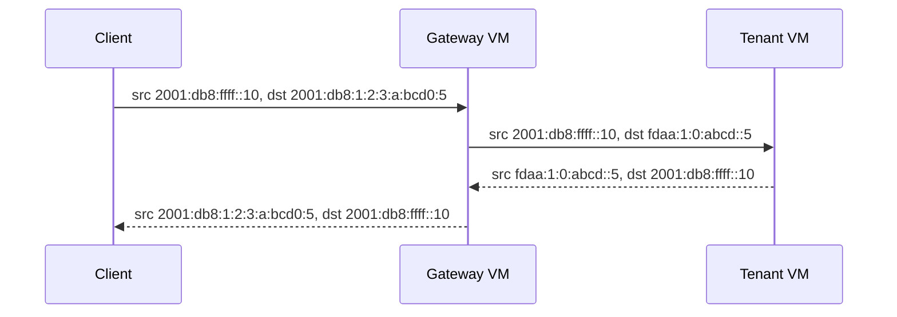

# Gateway VMs

A gateway VM carries packets between WG Mesh and a network outside the mesh. It is a privileged tenant-0 VM with the network-gateway role. Privilege permits cross-tenant delivery. The gateway role permits packets with client addresses outside the mesh.

## Why the gateway role matters

Normal tenant isolation rejects a packet with an outside source address. Without the gateway role and a return route on the tenant VM, a router would need to replace the client's source address with its own mesh address. The VM would see the router as the client.

To keep the real client address, the VM also needs a route that sends its reply back through the router.

The gateway role lets the router send a packet with the real client source through WG Mesh. A gateway route on the tenant VM permits that source and directs the reply to the router.

For the inbound packet, the router uses destination NAT (DNAT) to change the public destination to the VM's mesh address. It does not need source NAT (SNAT), so the guest can see and log the real client address.

The router still changes the **source** of the reply from the mesh address to the public address. The gateway service owns these translations and any firewall policy. WG Mesh carries the packet and enforces the return-route check.

## How the packet changes

This example uses region `1`, tenant `0xabcd`, and VM `5`. Its mesh address is `fdaa:1:0:abcd::5`. The tenant-0 router is `fdaa:1::56` and owns `2001:db8:1:2:3::/80`. That block maps the VM to `2001:db8:1:2:3:a:bcd0:5`. The client is `2001:db8:ffff::10`.

The tenant VM has a `2000::/3` route through `fdaa:1::56`, so replies to public IPv6 clients return through the router.

The tenant VM sees the client's `2001:db8:ffff::10` source and its own `fdaa:1:0:abcd::5` destination. It replies from its mesh address. The router presents the derived public address to the client. The [Atlas IPv6 router](../ipv6-router.md#how-the-address-maps) does this without a per-connection mapping.

## What the two VM flags mean

| Flag | Effect |
| --- | --- |
| Privileged | Atlas lists the tenant-0 VM during host sync. WG Mesh permits it to cross tenant boundaries. |
| Network gateway | Metal and WG Mesh prepare the VM to carry non-mesh traffic and public prefixes. |

These flags do not install a router or firewall inside the guest. Atlas permits the gateway role only on a privileged tenant-0 VM. [Network basics](../index.md) explains the host, WireGuard, and mesh layers.

## Host delivery and movement

The provider sends a public-prefix packet to the host that owns the gateway VM. The host public hook and route deliver it to that VM.

WG Mesh checks that the target tenant VM has a gateway return route covering the client address. Without that route, it drops the packet even when the public address maps to a valid VM address.

WG Mesh chooses a gateway from the VM's routes by the longest matching destination prefix. When the gateway moves, the old host forwards packets for its public prefix for five minutes while the provider learns the new host. The first packet during a lookup or move can be lost. Clients retry.

## Use the Atlas IPv6 router

The [IPv6 Router Server](../ipv6-router.md#prepare-the-router-vm) is Atlas's managed gateway service. Create it from the IPv6 Router Server list and select its Public IP Pool. Atlas creates the VM, grants privilege, enables the gateway role, attaches the pool, and installs translation software.

The router maps each public IPv6 address to a VM mesh address without a per-VM forwarding list. Atlas adds the return route to each tenant VM that receives a routed allocation. Read the [router address mapping](../ipv6-router.md#how-the-address-maps) for the exact bit layout.

## Build another gateway service

For another service, create a tenant-0 VM, select **Dangerous Actions > Grant Privilege**, then **Actions > Make Network Gateway**. Configure its destination routes in Atlas and install forwarding software in the guest. A public prefix also needs provider routing and a host-owned prefix. The VM flags alone do not attach one.

::: info Keep packet policy in the service
WG Mesh transports packets and checks tenant and return-route rules. The gateway service owns address translation, forwarding, and firewall policy. A working mesh route does not prove that the guest forwards traffic.
:::

## Check a gateway path

Check the provider route and public neighbor entry, then the host's prefix owner, gateway VM, WG Mesh path, tenant return route, and tenant firewall. For the managed router, use [IPv6 router checks](../ipv6-router.md#limits-and-recovery). [WG Mesh operations](operations.md) lists host map and peer checks.

::: details Source code and tests

- [VM gateway action](../../../atlas/vm/doctype/virtual_machine/virtual_machine.py) controls the VM role.
- [Metal mesh setup](../../../metal/internal/network/mesh.go) installs gateway and owned-prefix routes.
- [WG Mesh packet rules](../../../services/wg-mesh/bpf/vm.h) enforce gateway and return-route checks.
- [Public prefix rules](../../../services/wg-mesh/bpf/uplink.h) handle owned and moved prefixes.

:::
