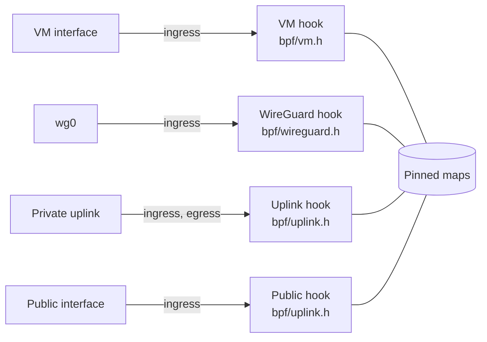
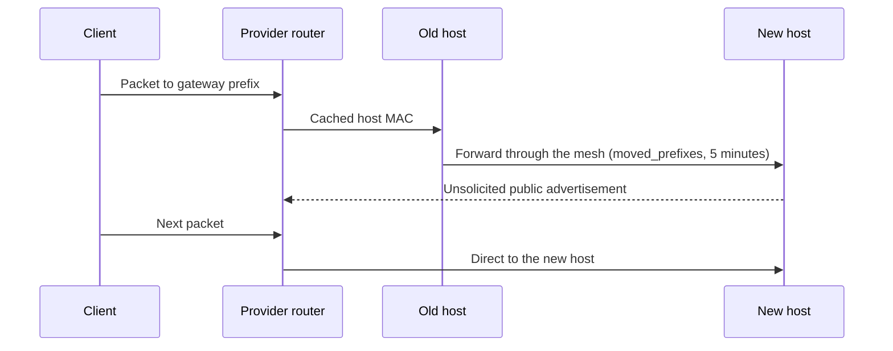

# WG Mesh design and packet rules

This page lists the exact rules and state of WG Mesh. Read [how VMs reach each other](../index.md) first. It explains the layers, lookups, privileged VMs, and gateways in plain terms.

## Addresses

| Range | Use |
| --- | --- |
| `fdaa::/16` | VM addresses: `fdaa \| region 16 bits \| tenant 32 bits \| VM ID 64 bits`. |
| `fdab::/16` | Host WireGuard addresses. |

For example, `fdaa:1:0:2::3` is region `1`, tenant `2`, VM `3`. The data path reads the tenant field for isolation.

## Hooks and state

All hooks are `tc` programs built from one BPF object, and they share one set of pinned maps.

For the Linux interface beneath these hooks, read the [kernel's BPF program and TC attach types](https://docs.kernel.org/bpf/libbpf/program_types.html).

| Map | Holds |
| --- | --- |
| `config` | Host interfaces, addresses, and MAC addresses. |
| `local_vms` | VM address to local interface. |
| `remote_vms` | Remote VM address to host WireGuard address. Least recently used entries are evicted. |
| `privileged_vms` | Tenant-0 addresses that can reach every tenant. |
| `peer_list` | Peer IPv4, MAC, and WireGuard addresses. |
| `discovery_limits` | NDP request limit for each VM interface. |
| `gateways` | Interfaces of the gateway VMs on this host. |
| `gateway_routes` | VM and destination prefix to gateway address. |
| `owned_prefixes` | Public prefix to owner interface. |
| `moved_prefixes` | Public prefix of a gateway that left this host, with a 5-minute expiry. |
| `announcement_limits` | Next allowed advertisement for each moved prefix address. |
| `build_hash` | Hash of the active BPF object. |

A `remote_vms` entry stays until eviction or a valid `NOT_HERE` removes it. Only the host stored for a VM can remove that entry.

## VM hook rules

The VM hook checks each packet a VM sends, in this order:

1. Drop traffic to the host range `fdab::/16`.
2. Send a destination that has a gateway route to its gateway.
3. Drop a packet whose source address the VM does not own.
4. Drop a packet to another tenant, unless one side is privileged.
5. Drop a foreign source to a local VM that has no gateway route back to that source.
6. Leave local delivery to Linux.
7. Tunnel a known remote destination through WireGuard.
8. Start an NDP lookup for an unknown destination. Each interface can start 10 lookups a second, with a burst of 50.

## Lookup (NDP)

The VM hook replaces the first packet with a neighbor solicitation on the private uplink. The destination host answers with proxy NDP, and the uplink hook maps the answering peer's MAC address to its WireGuard address in `remote_vms`. A later packet or transport retry uses that entry.

`configure` sets `proxy_delay` to `0` on the uplink. Otherwise Linux delays a proxied answer by up to 0.8 seconds, and the mesh drops packets until the answer arrives.

The [Linux IPv6 sysctl reference](https://docs.kernel.org/networking/ip-sysctl.html) explains `proxy_ndp` and other host-side NDP settings.

Some underlays cannot carry multicast. In unicast mode, the uplink egress hook wraps each NDP packet in IPv4 protocol 41 and sends one copy to each peer. The receiving uplink hook checks the peer address and removes the IPv4 header.

When a VM moves, `vm sync` sends an unsolicited neighbor advertisement, so every peer learns the new host at once. `NOT_HERE` only repairs a missed advertisement.

## WireGuard hook rules

The WireGuard hook handles packets between `fdab::/16` addresses only.

| Packet arriving on `wg0` | Action |
| --- | --- |
| Tunnel to a local VM | Remove the outer IPv6 header and deliver. |
| Foreign source to a local VM without a gateway route back | Drop. |
| Tunnel to a VM that is not here | Reply `NOT_HERE` to the sender. |
| Gateway tunnel | Deliver to the local gateway that the tunnel names. |
| Client packet for a local public prefix | Advertise the address on the public interface once, then deliver. |
| Valid `NOT_HERE` | Remove the old location and start a new lookup. |

`NOT_HERE` uses IPv6 next header `253` and carries one VM address. A gateway tunnel uses next header `254`: the gateway address comes first, then the client packet. A gateway that is not on the host also returns `NOT_HERE`.

## Gateways

A gateway route selects a gateway by the longest destination prefix. A host can run several gateways. The tunnel names the gateway, so the receiving host delivers to that VM. The 16-byte gateway header fits the MTU: 1380 + 40 + 16 is 1436, and WireGuard carries 1440.

The public interface hook answers NDP for addresses in an owned prefix. The provider router caches the host MAC for each address and does not ask again when a gateway moves:

[Gateways](gateways.md) explains how to configure one.

## Limits and recovery

NDP assumes a trusted host network. A lookup or move repair can drop a packet that the client must retry.

For a private traffic fault, check Metal's WireGuard peers and the VM namespace first, then `local_vms` and `remote_vms`. WG Mesh cannot repair a wrong Atlas address or a missing Metal link. [Operations](operations.md) has the inspection commands. WG Mesh does not own WireGuard keys, peer selection, NAT, DNS, or guest firewalls.

## Experimental

`NOT_HERE` (next header `253`) and the gateway tunnel (`254`) are working formats, not Internet standards.

::: details Source code and tests

- [WG Mesh specification](../../../services/wg-mesh/SPEC.md) defines service scope.
- [VM hook](../../../services/wg-mesh/bpf/vm.h) owns guest packet checks and lookup.
- [WireGuard hook](../../../services/wg-mesh/bpf/wireguard.h) handles cross-host delivery and repair.
- [Uplink hook](../../../services/wg-mesh/bpf/uplink.h) records lookup answers, unicast NDP, and public prefixes.
- [Maps](../../../services/wg-mesh/bpf/maps.h) defines the shared state.
- [Metal mesh attachment](../../../metal/internal/network/mesh.go) installs host and VM state.

:::
