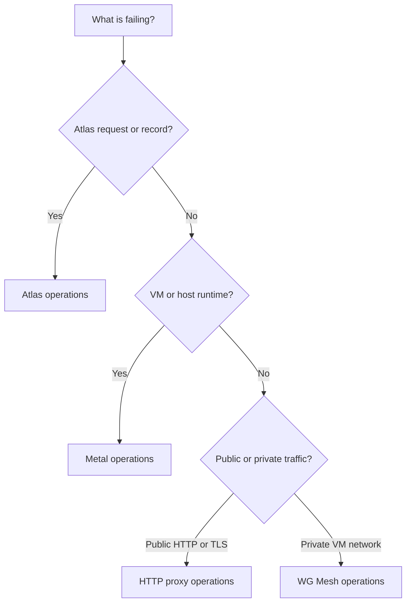

# Operations guide

Use the guide that owns the failing behavior. Atlas owns intent and provider resources. Metal owns host runtime state. The services own public routing and private VM traffic.

## Atlas app

Use [Atlas operations](../atlas/docs/operations.md) for placement, Metal Server, image, proxy, and public IPv4 failures.

## Metal

Use [Metal operations](../metal/docs/operations.md) for reconciliation, Firecracker, network, storage, console, and host shutdown failures.

## HTTP proxy

Use [proxy setup](../services/http-proxy/docs/setup.md) to check services and [high availability](../services/http-proxy/docs/high-availability.md) to check cluster state.

## WG Mesh

Use the [WG Mesh operations guide](../services/wg-mesh/docs/operations.md) for installation, virtual machine state, host recovery, and upgrades. Use `atlas-wg-mesh inspect <address>` to find one VM address.

## General rule

Read current state before you repeat an external operation. Atlas and Metal keep durable intent so a retry can continue after a worker or daemon restart.
