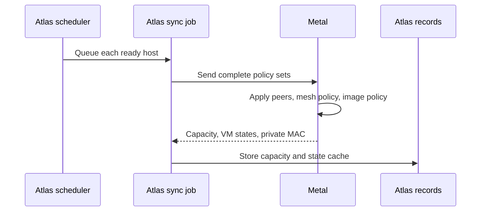

# Host sync and recovery

Host sync sends regional policy to Metal and returns host capacity and VM state to Atlas. Metal's own reconciler keeps VMs running between syncs.

## What a sync exchanges

The scheduler selects Metal Servers that are `Running` with completed setup.

| Direction | Data |
| --- | --- |
| Atlas → Metal | Complete WireGuard peer set, privileged VM addresses, image cache policy, and transport mode. |
| Metal → Atlas | Capacity, VM states, and private interface MAC address. |

Metal replaces its managed policy sets and wakes the relevant reconcilers. Atlas stores a capacity sample and updates its VM state cache.

### Why sync sends complete sets

A complete set repairs policy after a restart or missed sync. Atlas includes a peer only after it has keys, network addresses, and a private interface MAC.

The Atlas `Virtual Machine State` record remains a **cache**. Read Metal when you need current guest state.

## Failure and recovery

| Failure | Result |
| --- | --- |
| Invalid or failed sync | Atlas logs the failure and writes no new capacity sample. |
| Sample older than 2 minutes | Placement excludes the host. |
| Policy partly applied | The next full sync can apply it again. |
| Atlas unavailable | Metal continues VM, image, and migration reconciliation. |
| Metal restarts | It reads its saved records. Guests survive only if systemd preserved their console descriptors. |

Check the latest `Metal Server Usage` timestamp, Atlas Error Log, Metal journal, and VM record.

**Details:** [Placement](../compute/placement.md), [Metal operations](../operate/metal.md), and the [Metal sync API](/api/metal/).

::: details Source code and tests

- [Atlas scheduler](../../atlas/hooks.py) queues periodic sync.
- [Atlas sync job](../../atlas/metal_server/usage.py) builds policy sets and stores reported state.
- [State cache](../../atlas/vm/core/vm_state.py) stores last-reported VM states.
- [Metal host service](../../metal/internal/host/service.go) applies complete sets and reports capacity.
- [Metal startup](../../metal/cmd/metald/main.go) restores host services and consoles.
- [Atlas state tests](../../atlas/vm/core/test_vm_state.py) and [Metal host tests](../../metal/internal/host/service_test.go) check the contracts.

:::
