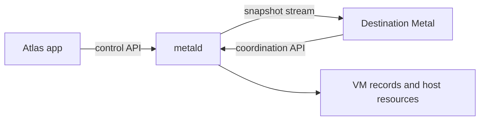

# Metal daemon and API

`metald` is the process on a physical host that accepts Atlas VM requests and applies them to host resources. It also coordinates migration with other Metal hosts. [Work on Metal](../develop/metal.md) maps the Go packages. This page explains the running process.

## Three connection roles

| Connection | Used for | Who can call it |
| --- | --- | --- |
| Control API | VM changes, snapshots, host sync, migration requests. | Atlas client certificate with its pinned common name. |
| Coordination API | Calls between source and destination during migration. | A certificate from the regional authority. |
| Snapshot stream | Direct ZFS transfer between migration hosts. | One-shot mutual TLS with regional authority validation. |

The listeners separate Atlas control calls from host-to-host migration calls. The control listener accepts the pinned Atlas client identity. The coordination listener belongs on WireGuard and accepts regional node certificates without a pinned node common name.

Disk snapshots use a separate stream because they carry ZFS data rather than API messages. The control and coordination APIs use TLS 1.3. Read [Metal listener security](../interfaces/security.md#metal-listeners) before you expose an address.

## What happens at startup

Run `metald serve` with `/var/lib/metal/metald.toml`, or pass `--config` for another file. Startup runs in this order:

1. Load TLS credentials and validate the snapshot bind address.
2. Prepare WG Mesh when enabled, create host directories, and connect to systemd.
3. Open storage and adopt serial consoles for running VM units.
4. Create the VM, host, migration, network, and API services.
5. Start the control and coordination listeners and background workers.

The VM and migration workers check for work every five seconds. The image worker checks every hour. Relevant requests also wake workers. The [reconciliation guide](../compute/reconciliation.md) explains why a saved request can still be in progress.

::: info Console adoption affects guest survival
At startup, Metal compares running VM units with adopted console handles. If systemd cannot preserve those handles, a later `metald` exit can stop running guests. See [runtime recovery](../compute/runtime.md#limits-and-recovery) and [Metal operations](../operate/metal.md#vms-stop-when-metald-stops).
:::

## Find a listener or record

| Setting | Default | What to check |
| --- | --- | --- |
| Control address | `127.0.0.1:8080` | Installed hosts need an Atlas-reachable address. A Unix socket is also accepted. |
| Coordination address | `127.0.0.1:9001` | Use the host's WireGuard address when installed. |
| Snapshot port | `9002` | Binds on the coordination host address, not a wildcard. |
| `base_dir` | `/var/lib/metal` | Holds VM records and host state. |
| `zfs.pool` | `metal` | Names the pool Metal uses. Installation selects its device. |

The CA, server certificate, private key, and Atlas client common name are required at startup, even if the default TOML file is absent. The [metald specification](../../metal/cmd/metald/SPEC.md) lists the remaining configuration keys.

## Follow a request or failure

The [Atlas to Metal contract](../interfaces/metal-contract.md) defines request, retry, unit, and error rules. The [Metal API reference](/api/metal/) lists routes and schemas. Use the request ID in the response to find local logs. Operation IDs connect later host work to the original change.

`POST /v1/sync` replaces managed host policy and reports capacity and VM states. It is not a guest health check. The [host sync guide](host-sync.md) explains its inputs and freshness.

Metal hides command output and secrets in public errors. Read host logs and the VM's observed phase when an accepted request does not finish. The [console guide](../compute/console.md) explains the browser's WebSocket path and the difference between serial and SSH sessions.

## What shutdown stops

Shutdown stops listeners and workers, cancels uploads and migration streams, and closes owned connections within a bounded wait. It does not ask systemd to stop VM units. Guest survival depends on preserved console handles, as described above.

::: details Source code and tests

- [Daemon composition](../../metal/cmd/metald/main.go) defines startup, listeners, and worker intervals.
- [Configuration](../../metal/cmd/metald/config.go) defines TOML defaults.
- [TLS rules](../../metal/cmd/metald/tls.go) define client certificate checks.
- [Shutdown](../../metal/cmd/metald/daemon.go) releases the daemon's resources.
- [TLS tests](../../metal/cmd/metald/tls_test.go) check certificate validation.

:::
