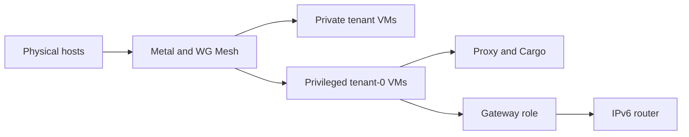

# Architecture

The Atlas app owns regional decisions. Metal owns execution on each host. The network services carry VM traffic.

New to desired and observed state? Read [how a VM request works](how-a-vm-request-works.md) first.

## Build the system from the bottom up

Metal runs VMs on physical hosts. WG Mesh gives each VM a stable private address and carries packets across hosts. Atlas decides which VMs and services to create. It is not in the packet path.

A **privileged VM** is a tenant-0 VM that can reach other tenants through WG Mesh. The proxy and Cargo use that access.

A **gateway VM** is a privileged VM with an extra network role. It can receive traffic for an external prefix and forward client packets through the mesh. The IPv6 router uses that role.

Regional services build on these blocks. The HTTP proxy accepts application requests. The IPv6 router forwards client packets. [How VMs reach each other](../networking/index.md) explains the network rules. [Service VMs](../region/service-vms.md) explains how Atlas creates these services.

## Who owns what

| Component | Owns |
| --- | --- |
| Atlas app | Provider hosts, VM host selection and lifecycle requests, images, addresses, service setup, DNS, and certificates. |
| Metal | Host VM records, capacity, Firecracker processes, ZFS disks, local images, networking, and migration execution. |
| HTTP proxy | Site and domain route maps, replication, and public HTTP forwarding. |
| WG Mesh | Private IPv6 forwarding, tenant isolation, and VM location discovery. |
| IPv6 router | Translation between a public IPv6 block and regional mesh addresses. |

Atlas creates Cargo, proxy, and router VMs through the same VM service used for tenant requests.

**External systems:** Central and Cargo have implementations outside this repository. Atlas accepts Central service tokens and installs Cargo on a service VM. The [Cargo guide](../region/cargo.md) describes the integration present here.

## Where state lives

| State | Stored in | After a crash |
| --- | --- | --- |
| Regional requests and assignments | Atlas DocTypes in MariaDB | Atlas jobs resume from committed records. Redis supports jobs and temporary data. |
| Host VM requests and progress | Metal `config.json` and `status.json` | Metal resumes unfinished work. Invalid records stop manager startup. |
| Guest disks and local artifacts | ZFS and Metal files | Metal resumes storage work. Object storage holds source image artifacts. |
| Private networking | Host links, WireGuard, and WG Mesh maps | Host sync restores policy. Metal restores VM links. WG Mesh learns locations again. |
| Public route maps | Each proxy node's snapshot and generation | The proxy cluster elects a leader and repairs stale nodes. |

Atlas's `Virtual Machine State` is a **cache of the last host report**. VM lists and image-use checks read it. Use Metal for current host state.

## How the parts talk

| Path | Protocol or purpose | Details |
| --- | --- | --- |
| Client → Atlas | HTTPS with an issuer-bound EdDSA token | [Tenant API](../interfaces/tenant-api.md) |
| Atlas → Metal | Mutual TLS for control and host sync | [Metal daemon and API](../region/metald.md) |
| Browser → realtime bridge → Metal | Console token, then a mutual-TLS WebSocket | [Console access](../compute/console.md) |
| Metal → Metal | Coordination API and separate TLS disk stream | [Migration](../compute/migration-engine.md) |
| Central or Atlas → proxy | Route changes through the control API | [HTTP proxy](../networking/http-proxy/index.md) |
| Public client → guest | OpenResty, host routes, or IPv6 translation | [Traffic paths](../networking/traffic.md) |

Atlas calls provider and DNS APIs for hosts and public records. Atlas and Metal use object storage for image artifacts. The [security model](../interfaces/security.md) explains the credentials.
