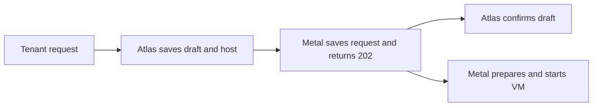

# How a VM request becomes a running VM

Atlas decides where a VM belongs. Metal on that host creates its disk and network, then starts it. Both components save their work so they can recover after a failure.

**An accepted request is not a running VM.** A `202 Accepted` reply means Metal saved the request. Host work continues in the background.

## Follow one create request

Atlas first checks the image and recent host capacity. It then commits a **draft**: a VM record with a fixed ID and a host reservation. Atlas sends the complete VM request to Metal with that ID.

Metal writes two files before it accepts the request. `config.json` says what should run. `status.json` starts with an unknown VM state and later records progress or an error. A background loop makes the host match `config.json`.

Atlas clears the draft flag after Metal replies. A later host report updates the Atlas VM list. That list can be older than the state on Metal.

## Why the draft remains after a timeout

A lost reply does not tell Atlas whether Metal saved the VM. Atlas keeps the draft and its capacity reservation. After the draft is 2 minutes old, a scheduled job reads the VM from Metal:

| Metal reports | Atlas does |
| --- | --- |
| VM exists | Confirms the draft. |
| VM is absent | Removes the draft and reservation. |
| Host cannot be reached | Keeps the draft for another check. |

A retry with the same VM ID and matching request does not create another VM. Metal rejects a different create request under that ID. If Atlas stops after Metal accepts the request, Metal continues from its saved files.

## Know which state to read

| Question | Read | Why |
| --- | --- | --- |
| Which host and resources did Atlas choose? | Atlas VM record | It holds the request and host assignment. |
| What should this host run? | Metal `config.json` | It holds the latest requested state. |
| What did the host last do? | Metal `status.json` | It holds the applied state, phase, error, and cleanup progress. |
| What does the Atlas VM list show? | Atlas `Virtual Machine State` | It caches the last host report. |

Metal gives each requested change a **desired generation**, or revision number. When it applies the change, the **observed generation** catches up. If the numbers differ, work is still in progress or has failed. Read the phase and error to find out which.

Matching numbers show that Metal applied the request. They do not prove that the guest application is healthy. For current host state, ask Metal. For the full create, change, and delete flow, read [Create and manage a VM](../compute/index.md).

::: details Source code and tests

- [Atlas VM service](../../atlas/vm/core/vm_service.py) commits drafts and calls Metal.
- [Atlas draft check](../../atlas/vm/core/reconciliation.py) settles drafts and terminated records.
- [Atlas state cache](../../atlas/vm/core/vm_state.py) stores last-reported states.
- [Metal record store](../../metal/internal/vm/records.go) defines desired and observed records.
- [Metal VM manager](../../metal/internal/vm/manager.go) stores create requests.
- [Atlas VM service tests](../../atlas/vm/core/test_vm_service.py) and [Metal manager tests](../../metal/internal/vm/manager_test.go) cover the request boundary.

:::
