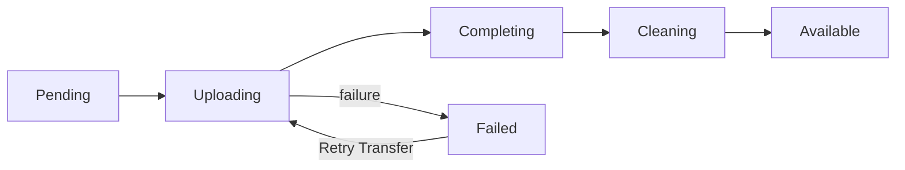

# VM images and artifact storage

The Atlas app owns image records and published artifacts. Metal caches them on hosts and creates VM disks. See the [transfer flow](index.md) for the sequence.

| Image type | Access |
| --- | --- |
| System | Shared with every tenant. |
| Machine | Owned by the source VM's tenant. |

An image records its kernel, root filesystem, architecture, sizes, and SHA-256 digests. **Only an enabled, Available image can create a VM.**

## System images

The Ubuntu builder stores a kernel and root filesystem, calculates their digests, and creates or updates an Available System image.

An unchanged build keeps its version. A changed build increases the version after both artifacts are stored.

::: info Guest disk errors
New Ubuntu System images set ext4 to remount the root filesystem read-only when it detects an error. This stops further writes to a damaged filesystem. It does not repair the disk. The [guest disk incident](../incidents/2026-09-24-guest-disk-corruption.md) explains why this guard was added.
:::

## Artifact storage

The `artifact_storage` field selects the artifact location:

| Value | Location | Download URL |
| --- | --- | --- |
| `Object Storage` | Atlas Settings bucket, under `vm-images/sha256/<digest>/<name>` | Signed. Valid for 24 hours. |
| `Site File` | Public site File under `/files/` | Public. No expiry. |

### Bootstrap without object storage

Build the first System image with `--storage site-file`. Set `atlas_base_url` to an address the host can reach.

Site Files are public, so only System images can use them. The tenant download route refuses Site File images.

### Move artifacts to object storage

Saving object-storage settings queues migration of Available Site File images. A job repeats the search every **15 minutes**, including failed migrations. **Migrate to Object Storage** starts one immediately.

For each image, the job:

1. Uploads both artifacts under content-addressed keys and compares sizes.
2. Saves the keys and changes `artifact_storage`.
3. Deletes the site Files.

A downloadable copy remains at each step. The `immutable_reference` uses architecture and digests, so hosts keep their existing cache.

## Machine images

Select **Create Machine Image** to stage the VM disk and kernel on Metal. Metal's UUIDv7 snapshot ID becomes the Atlas image record name.

Atlas saves multipart upload IDs before it starts the transfer. It checks hashes and sizes before publication.

**On failure:** Atlas keeps the source host, snapshot ID, object keys, and upload IDs. **Retry Transfer** reuses them and the same image record. Signed URLs stay out of logs.

## Listing

- `GET /api/atlas/images`: enabled tenant images and enabled System images. Filter with `image_type=system` or `image_type=machine`.
- `GET /api/atlas/images/<image ID>`: also returns disabled images so clients can follow retirement.

## Image status

The diagram shows the normal Machine image transfer and its retry path. A transfer can also fail before upload or during completion. Retirement changes an Available or Failed image to `Archived` or `Deleting` as described below.

## Retirement and deletion

Retire an Available or Failed image to disable new use immediately. Retiring an already `Deleting` or `Archived` image changes nothing.

| Image | Result |
| --- | --- |
| System image | `Archived`. Shared artifacts remain. |
| Unused Machine image | `Deleting`. A job removes objects, Metal staging, and the record. |
| Machine image still in use | `Archived`. Changes to `Deleting` after its last VM is deleted. |

Image-use checks read the last-reported `Virtual Machine State` cache. Cleanup failures keep `Deleting`, record the error, and retry every **30 seconds**.

## Cached and warm artifacts

Host sync requests caching for enabled Available images with `cache_image`.

A warm artifact contains disk, memory, and Firecracker state for one exact image and VM shape. It stays on its host. If a shared warm artifact cannot be used, boot falls back to a cold start.

## Limits and recovery

Check artifact URL access and free host storage before retrying a transfer. See [Metal storage](host-storage.md) for local staging and cleanup, and the [Atlas API](/api/atlas/) for image operations.

::: details Source code and tests

- [Image DocType](../../atlas/vm/doctype/virtual_machine_image/virtual_machine_image.py) owns image metadata and visibility.
- [System image builder](../../atlas/vm/core/image_builder.py) publishes base artifacts.
- [Ubuntu image script](../../atlas/vm/scripts/build_ubuntu_server_image.sh) builds the guest root filesystem and sets its error behavior.
- [Machine image transfer](../../atlas/vm/core/vm_image_transfer.py) owns snapshot progress.
- [Storage migration](../../atlas/vm/core/vm_image_storage_migration.py) moves bootstrap files to object storage.
- [Image deletion](../../atlas/vm/core/vm_image_deletion.py) retires and reclaims artifacts.
- [Object storage client](../../atlas/atlas/object_storage.py) owns signed URLs and object operations.

:::
