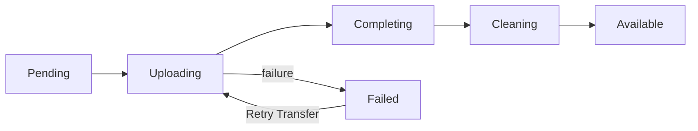

# VM images and artifact storage

Atlas owns image records and artifacts. Metal caches the artifacts on hosts and creates VM disks. See the [transfer flow](index.md) for the sequence.

| Image type | Access |
| --- | --- |
| System | Shared with every tenant. |
| Machine | Owned by the source VM's tenant. |

An image records its kernel, root filesystem, architecture, sizes, and SHA-256 digests. **Only an enabled, Available image can create a VM.**

## System images

The Ubuntu builder publishes a kernel and root filesystem as a new Available System image. Each build gets a new record and its own artifact paths.

The builder checks earlier Available images with the same title and architecture. If one has the same digests, the build changes nothing.

After publication, the builder retires the earlier images.

Atlas protects each new System image from termination. The builder removes this protection from the earlier images before it retires them.

::: info Guest disk errors
New Ubuntu System images set ext4 to remount the root filesystem read-only when it detects an error. This stops further writes to a damaged filesystem.

The remount does not repair the disk. See the [guest disk incident](../incidents/2026-09-24-guest-disk-corruption.md) for the reason behind this setting.
:::

## Artifact storage

The `artifact_storage` field selects the artifact location:

| Value | Location | Download URL |
| --- | --- | --- |
| `Object Storage` | Atlas Settings bucket, under `images/<image ID>/` | Signed. Valid for 24 hours. |
| `Site File` | Public site File under `/files/` | Public. No expiry. |

### Bootstrap without object storage

Build the first System image with `--storage site-file`. Set `atlas_base_url` to an address the host can reach.

Site Files are public, so only System images can use them. The tenant download route refuses Site File images.

### Move artifacts to object storage

Saving object-storage settings queues migration of Available Site File images. A job checks again every **15 minutes**, including images whose earlier migration failed.

Use **Migrate to Object Storage** to start one migration immediately.

For each image, the job:

1. Uploads both artifacts under keys owned by the image and compares sizes.
2. Saves the keys and changes `artifact_storage`.
3. Keeps the site Files for six hours so hosts can finish earlier downloads, then deletes them.

Hosts have a downloadable copy at each step. The `immutable_reference` uses architecture and digests, so hosts keep their existing cache.

## Machine images

Select **Create Machine Image** to stage the VM disk and kernel on Metal. Metal's UUIDv7 snapshot ID becomes the image record name.

Atlas saves multipart upload IDs before it starts the transfer. It checks hashes and sizes before publication.

If a transfer fails, Atlas keeps the source host, snapshot ID, object keys, and upload IDs. **Retry Transfer** uses the same image record and upload IDs.

Atlas does not write signed URLs to logs.

## Listing

- `GET /api/atlas/images`: enabled tenant images and enabled System images. Filter with `image_type=system` or `image_type=machine`.
- `GET /api/atlas/images/<image ID>`: also returns disabled images so clients can follow retirement.

## Image status

The diagram shows a Machine image transfer and its retry path. A transfer can also fail before upload or during completion.

Retirement changes an Available or Failed image to `Archived`.

## Retirement and deletion

Retire an Available or Failed image to stop new use immediately. Retiring an image that is already `Deleting` or `Archived` changes nothing.

Termination protection blocks retirement for both System and Machine images.

Atlas keeps a retired image's objects or public site files for six hours. This gives hosts time to finish downloads that started before retirement.

A migrated image also keeps its old site files until the separate migration deadline ends.

After the deadline, Atlas deletes the remote artifacts and Metal staging, even if VMs still use the image. Those VMs normally boot from local host storage. The remote recovery copy is no longer available.

The image record stays `Archived` while any VM record names it. After the last VM record is deleted, Atlas changes the image to `Deleting` and removes its record.

Atlas records a cleanup failure and retries every **30 seconds**.

## Cached and warm artifacts

Host sync requests caching for enabled Available images with `cache_image`.

A warm artifact contains disk, memory, and Firecracker state for one image and VM shape. It stays on its host.

If a shared warm artifact cannot be used, the VM starts without it.

## Limits and recovery

Check artifact URL access and free host storage before you retry a transfer.

See [Metal storage](host-storage.md) for local staging and cleanup. See the [Atlas API](/api/atlas/) for image operations.

::: details Source code and tests

- [Image DocType](../../atlas/vm/doctype/virtual_machine_image/virtual_machine_image.py) owns image metadata and visibility.
- [System image builder](../../atlas/vm/core/image_builder.py) publishes base artifacts.
- [Ubuntu image script](../../atlas/vm/scripts/build_ubuntu_server_image.sh) builds the guest root filesystem and sets its error behavior.
- [Machine image transfer](../../atlas/vm/core/vm_image_transfer.py) owns snapshot progress.
- [Storage migration](../../atlas/vm/core/vm_image_storage_migration.py) moves bootstrap files to object storage.
- [Image deletion](../../atlas/vm/core/vm_image_deletion.py) retires and reclaims artifacts.
- [Object storage client](../../atlas/atlas/object_storage.py) owns signed URLs and object operations.

:::
