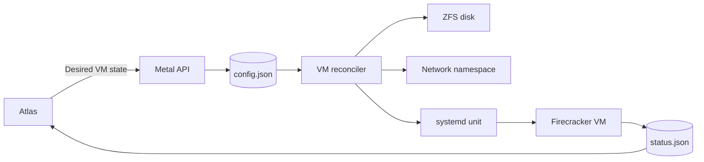

# Metal

Metal is the host daemon for Atlas virtual machines. The `metald` process manages one Linux host.

Metal stores desired VM state, observes host state, and reconciles the difference. It owns runtime, storage, network, and cleanup work.

## From desired state to a running VM

The API stores desired state before it returns `202 Accepted`. A reconciler applies host changes after the response.

## Why systemd owns VM processes

systemd runs each VM as a `metal-vm@` unit. A `metald` restart does not stop a running guest.

Metal rebuilds its view from durable records, systemd, and ZFS after a restart. It does not rely on old process memory.

## Start here

1. Read [Metal architecture](docs/architecture.md) to learn the state and ownership model.
2. Read [VM functionality](docs/vm.md) to follow VM lifecycle states.
3. Use [integration testing](docs/testing.md) to prepare a development host.
4. Use [Metal development](docs/development.md) before you submit a change.

## Choose a subsystem

| Subsystem | Responsibility | Guide |
| --- | --- | --- |
| VM manager | Desired state, lifecycle, locks, and cleanup | [VM functionality](docs/vm.md) |
| Firecracker runtime | Process launch, jail, warm start, and saved state | [Firecracker specification](internal/firecracker/SPEC.md) |
| Storage | Images, ZFS disks, snapshots, and transfer staging | [Storage](docs/storage.md) |
| Network | Namespaces, routes, traffic limits, and WG Mesh | [Networking](docs/networking.md) |
| Reconciler | Bounded passes that move state forward | [Reconciler specification](internal/reconciler/SPEC.md) |
| Host service | Controller sync, image policy, and capacity | [Host specification](internal/host/SPEC.md) |
| API | Atlas routes and node coordination routes | [HTTP API](docs/api.md) |
| Migration | Disk copy, cutover, finish, and rollback | [Migration internals](internal/vm/migration/SPEC.md) |

## Development requirements

Unit tests need Go. Host tests need Linux, root access, KVM, ZFS, systemd, iptables, and Atlas WG Mesh.

Run Go commands from `metal/`. The repository root is not a Go module.

Use the repository [Go review guide](../llm/go-code-review-guide.md) for Go changes.
