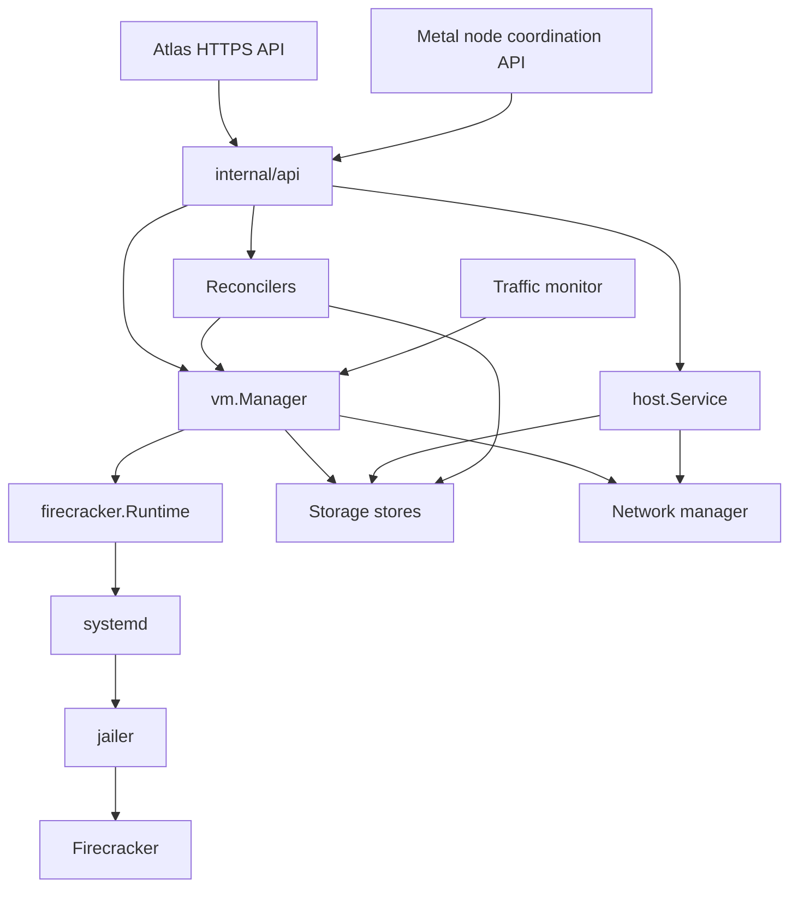
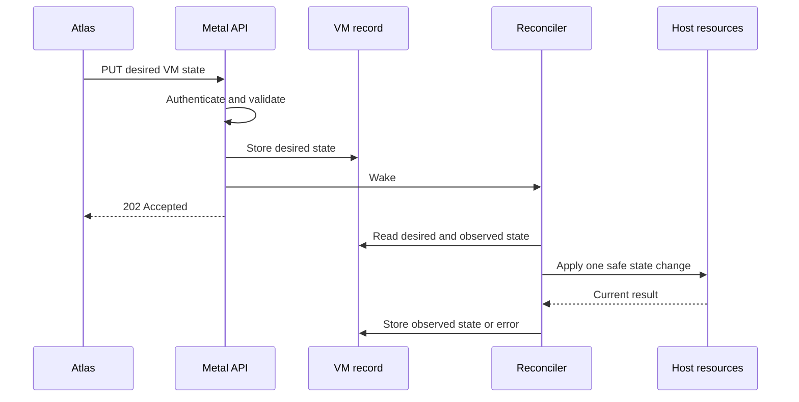
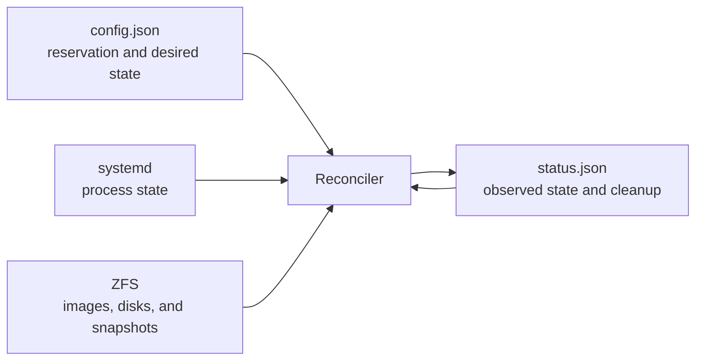
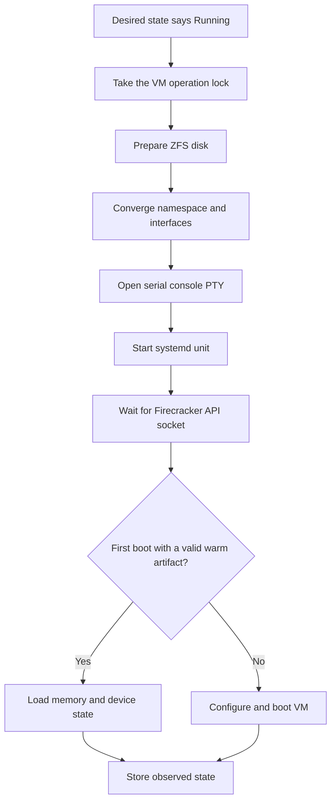

# Metal architecture

Metal manages Firecracker virtual machines on one host. It stores host intent on disk and makes host resources match that intent.

Read [How Atlas works](../../docs/architecture.md) first if the Atlas and Metal ownership boundary is new to you.

## The 2 rules that shape Metal

### systemd owns each VM process

Metal asks systemd to start and stop each Firecracker process. A `metald` restart does not stop a running VM.

After a restart, Metal reads files, ZFS, and systemd. It does not depend on old process memory.

### Metal stores intent, not commands

Atlas sends the complete desired VM state. Metal stores that state before it returns `202 Accepted`.

Reconcilers compare desired state with observed state. They repeat safe operations until both states match.

## Component map

`cmd/metald` creates these concrete services. Consumer packages define small interfaces only when they need a test or ownership boundary.

Read the [package map](../internal/SPEC.md) when you need the exact dependency direction.

## Request and reconciliation flow

An API handler validates a request and stores desired state. It then wakes a reconciler and returns before all host work finishes.

One pass makes bounded progress. A later pass continues after an error or restart.

## Durable state

Metal refuses to start when it cannot decode a VM record. A silent record loss is more dangerous than a stopped daemon.

The [host layout](host-layout.md) lists every persistent and runtime path.

## VM start scenario

Warm start is an optimization for the first boot only. Cold start is used for every later start, and when a warm artifact is absent or invalid.

## Failure and cleanup rules

- Metal holds one operation lock for each VM.
- Desired state remains durable after a runtime error.
- Cleanup progress remains on disk until every owned resource is gone.
- Mutual TLS protects Atlas API and node coordination requests.
- The source and destination keep migration locks until finish or rollback completes.

## Read next

| Topic | Guide |
| --- | --- |
| VM lifecycle and power state | [VM functionality](vm.md) |
| Images, disks, and snapshots | [Storage](storage.md) |
| Namespaces, routes, and WG Mesh | [Networking](networking.md) |
| Controller endpoints | [HTTP API](api.md) |
| Files and host resources | [Host layout](host-layout.md) |
| Development host setup | [Integration testing](testing.md) |
| Migration internals | [VM migration specification](../internal/vm/migration/SPEC.md) |
