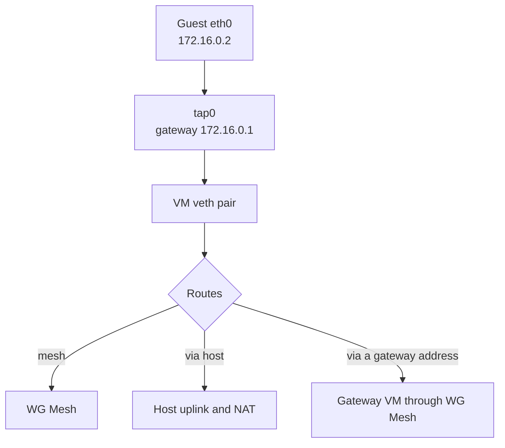
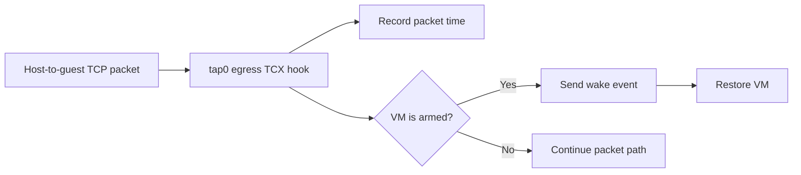

# Networking

For Go code, follow the repository [Go anti-pattern rules](../../llm/go-code-review-guide.md).

[metal SPEC](../SPEC.md) · detail: [internal/network/SPEC.md](../internal/network/SPEC.md)

Every virtual machine gets the same private addresses. That is safe because each VM owns its own Linux network namespace, so nothing has to be allocated per VM and nothing has to be remembered between restarts.

## Topology



The guest address is `172.16.0.2`, the gateway `172.16.0.1`, and the guest MAC `06:00:ac:10:00:02`, which encodes that address. A warm VM keeps the MAC of the snapshot it resumed from, so a fixed value keeps the reported MAC true.

Metal derives one transit `/30` from the VM user ID, which removes the need for a persisted address allocator.

The veth MTU is 1380, so the guest image sets `eth0` to 1380. A larger guest MTU depends on ICMP `fragmentation needed`, which some paths discard. The namespace clamps TCP MSS. UDP still depends on path MTU discovery.

## Routes

Every VM has the veth pair and a mesh address. `network.routes` decides what the VM reaches outside the mesh. A VM without routes reaches only mesh peers.

| `via` | Carries | Example |
|---|---|---|
| `host` | The host uplink. IPv4 leaves through namespace NAT. | `0.0.0.0/0` via `host` |
| A mesh address in `fdaa::/16` | A gateway VM through WG Mesh. IPv6 only. | `2000::/3` via `fdaa:1::56` |

```json
"routes": [
  {"destination": "0.0.0.0/0", "via": "host"},
  {"destination": "2000::/3", "via": "fdaa:1::56"}
]
```

Each destination can appear once, and the longest prefix wins. The namespace and the guest send each IPv6 destination to the host. The host uplink or WG Mesh then carries it. Metal adds IPv4 NAT only when an IPv4 route uses `host`.

A public address needs a route via `host`, because its replies leave through the host uplink:

| Field | Needs | Delivery |
|---|---|---|
| `public_ipv4` | an IPv4 route via `host` | The host maps the address to the guest with DNAT and SNAT. |
| `public_ipv6` as a larger block | an IPv6 route via `host` | The host routes the block into the VM. The guest configures its addresses. |

A warm image capture VM has no mesh address, so it gets no veth pair.

## Throughput limits

The VM configuration can set `private_network_throughput_mibps` and `public_network_throughput_mibps`. Each applies in both directions, and `0` means unlimited.

Private traffic uses the private IPv4 ranges and the mesh IPv6 range. Public traffic uses the remaining IPv4 addresses. The exact filters: [internal/network/SPEC.md](../internal/network/SPEC.md).

A VM without an IPv4 route via `host` has no public IPv4 path, so Metal keeps a public limit and does not apply it.

## Firewall

The VM firewall filters public and mesh traffic in the VM network namespace. A disabled firewall permits all traffic. Rules stay stored while the firewall is disabled.

An enabled firewall permits established and related connections. Allow rules then permit new inbound or outbound traffic. An empty rule list blocks new traffic in that direction.

Rules support `any`, `tcp`, `udp`, and `icmp`. TCP and UDP rules can select one destination port or one inclusive range. Each rule has one or more canonical IPv4 or IPv6 prefixes. One firewall can have at most 50 prefix entries across both directions.

Metal inspects changed firewalls on the next reconcile pass. It also audits unchanged filter tables once per minute and replaces external changes.

## Atlas WG Mesh

Each VM has a private IPv6 address in `fdaa::/16`. Atlas WG Mesh routes it between hosts. Metal registers the address when it creates the veth pair and unregisters it when it removes the pair.

How the mesh forwards packets and discovers VM locations: [Atlas WG Mesh design guide](../../services/wg-mesh/docs/design.md).

`metald` runs `configure` on every start. The command installs the mesh or replaces its BPF programs without a service interruption. Metal then applies each virtual machine configuration.

A VM can route destinations outside the mesh to a gateway VM, and a VM can own a public IPv6 block. Metal adds the namespace and host routes, and registers the complete VM state with `atlas-wg-mesh vm sync`. A gateway VM and a VM with a block route `::/0` through the host. See [Gateways](../../services/wg-mesh/docs/gateways.md).

Tenant 0 is the privileged tenant. A tenant-0 VM crosses tenants only when its address is in the Atlas WG Mesh whitelist, which `POST /v1/sync` carries in full.

A VM learns its address from MMDS. `atlas-metadata.service` reads `meta-data/mesh-ipv6` every 250 ms and writes a systemd-networkd drop-in. This updates the address after a warm snapshot resumes. The service then resets the guest resolver and time sync, because both resume backed off. It also reads `meta-data/host-routes`, the destinations the guest routes through the host. See [Per-VM metadata](../../atlas/vm/SPEC.md#per-vm-metadata).

Namespace routing, proxy NDP, MTU, public IPv4 rules, and filter placement: [internal/network/SPEC.md](../internal/network/SPEC.md).

## Packet activity and wake

Metal tracks TCP traffic from the host to the guest. It ignores other packets and all guest-to-host traffic. This prevents ARP and IPv6 housekeeping from keeping a VM awake.



The eBPF program observes packets but does not change them. It stores the last packet time by VM user ID.

The first packet can be lost while Firecracker starts. Clients must retry. A metald restart creates a new activity baseline. This can delay sleep, but it cannot make a VM sleep early. See [internal/network/SPEC.md](../internal/network/SPEC.md).

## WireGuard peers

`POST /v1/sync` supplies the complete managed peer set. Metal applies it to `wg0` and records what it applied, so it never disturbs peers added by other tools.

Each peer carries its mesh address, which becomes its `AllowedIPs` entry. Atlas owns the mesh address of each host, so Metal applies the address it receives and does not calculate one.

Each peer endpoint is the private address of its host, so the tunnel crosses the private network. Atlas WG Mesh NDP uses the same network. The WireGuard MTU follows the private network MTU for this reason.

Runtime `wg set` installs no system routes, so the manager also owns one `/128` route per peer into `wg0`. The encapsulated tunnel traffic from the mesh reaches `wg0` only through these routes. A peer that leaves the set loses its peer entry and its route. A missing route is reinstalled on the next apply, because routes do not survive a reboot but the managed peer state does.

## Design notes

- A namespace for each VM lets every guest use the same private IPv4 address.
- Deterministic addresses, MAC values, and veth names need no mutable allocator state.
- User-ID-derived veth names fit the Linux interface name limit.
- Routes are one concept for the host uplink and for gateway VMs. A route change keeps the veth pair, so it does not disturb the Atlas WG Mesh hook.
- The namespace routes the mesh address, because Atlas WG Mesh hooks the host end of the veth.
- MMDS carries the mesh address, because the address is per VM and the image is shared.
- Nothing per VM is baked into the image, so one image serves a cold VM and a warm VM.
- Tagged public IPv4 and IPv6 rules permit exact cleanup for one VM.
