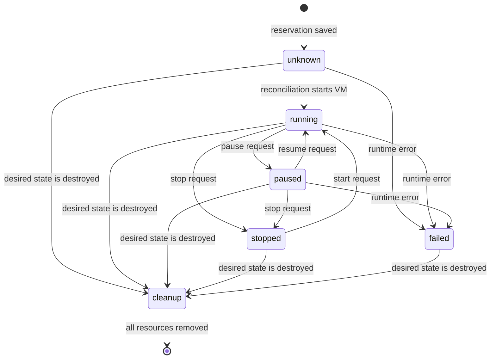
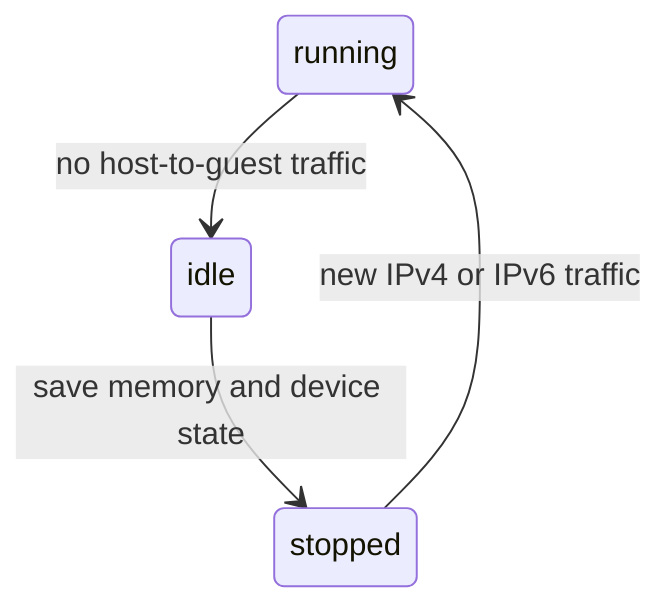

# VM functionality

For Go code, follow the repository [Go anti-pattern rules](../../llm/go-code-review-guide.md).

[metal SPEC](../SPEC.md) · contract: [internal/vm/SPEC.md](../internal/vm/SPEC.md)

A virtual machine has persisted desired state and observed host state. The controller requests changes, and Metal reconciles them.

## Lifecycle

Create reserves the supplied VM ID and requests `running`. Every mutation returns before host work completes. A caller polls until the desired and observed generations match.

A user power request supports `running`, `paused`, and `stopped`. A request for `stopped` always stops the VM without preserving guest memory.

## Starts and saved state

The first start of a VM can use a shared warm image when the image and VM shape match. A later start always uses a cold boot, because the VM disk no longer matches the warm memory. See [Guest disk corruption after a restart](../../docs/incidents/2026-09-24-guest-disk-corruption.md).

Automatic idle shutdown can preserve the memory of one VM. Metal keeps the public desired state as `running` and reports the observed state as `stopped` while Firecracker is not running.

Set `sleep_after_idle_seconds` in the compute settings. `0` disables automatic idle shutdown. Metal restores an automatically stopped VM after new host-to-guest IPv4 or IPv6 traffic. The first packet can be lost during restoration, so clients must retry.

Metal stores one saved state under `machines/<id>/saved-state/`. A restart, machine shape change, explicit stop, or VM removal deletes it. A restore failure keeps it for a later retry.

## Design notes

- The controller supplies the VM ID, so reservation retries use one stable resource.
- Desired state keeps API requests fast and lets reconciliation retry host operations.
- Observed state is separate because process changes are asynchronous.
- Compute and disk changes use separate endpoints because their safety rules differ.
- Warm images are a start optimization. VM saved state preserves one running guest.
