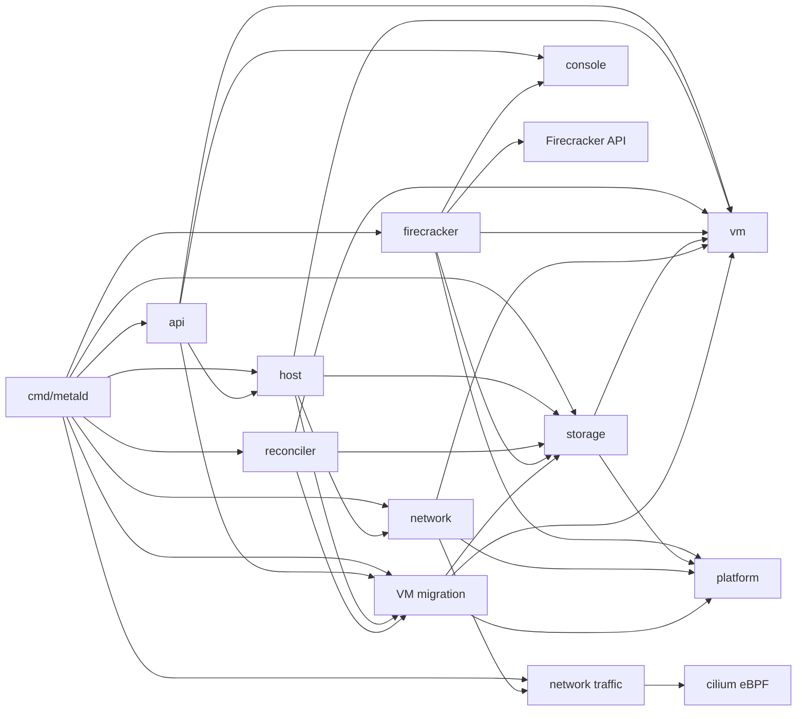

# internal: metald packages

For Go code, follow the repository [Go anti-pattern rules](../../llm/go-code-review-guide.md).

[metal SPEC](../SPEC.md) · overview: [docs/architecture.md](../docs/architecture.md)

## Purpose

`internal/` contains the Metal runtime packages. `cmd/metald` creates concrete services and injects them into consumers.

The `vm` package defines the contracts. The other packages implement or consume those contracts.

## Packages

| Package | Role |
|---|---|
| [vm](vm/SPEC.md) | VM manager, records, reconciliation, interfaces, and value types. |
| [firecracker](firecracker/SPEC.md) | Firecracker runtime and optional warm capability. |
| [firecracker/api](firecracker/api/SPEC.md) | Firecracker REST client over a Unix socket. |
| [api](api/SPEC.md) | Authenticated HTTP API. |
| [host](host/SPEC.md) | Host synchronization and capacity. |
| [console](console/SPEC.md) | VM serial consoles over PTYs. |
| [reconciler](reconciler/SPEC.md) | VM state, image cache, warm artifact, and staging cleanup loops. |
| [storage](storage/SPEC.md) | ZFS pool, VM disks, images, and snapshot staging. |
| [network](network/SPEC.md) | VM namespaces, host rules, and managed WireGuard peers. |
| [network/traffic](network/traffic/SPEC.md) | eBPF traffic tracking and packet events. |
| [platform](platform/SPEC.md) | Host files, commands, and systemd control. |
| [vm/migration](vm/migration/SPEC.md) | VM live migration: lifecycle, records, and host-to-host transport. |

## Dependency graph

The `vm/migration` package imports `vm`. The `vm` package does not import `vm/migration`. It reads migration lock state through an injected guard.

The `vm` package defines small host service interfaces. The `vm.Manager` owns VM state, operations, and warm-image orchestration.

## Related

- [metal SPEC](../SPEC.md) routes to concept documents.
- [cmd/metald/SPEC.md](../cmd/metald/SPEC.md) describes runtime construction.
- [docs/architecture.md](../docs/architecture.md) gives the broad architecture.
