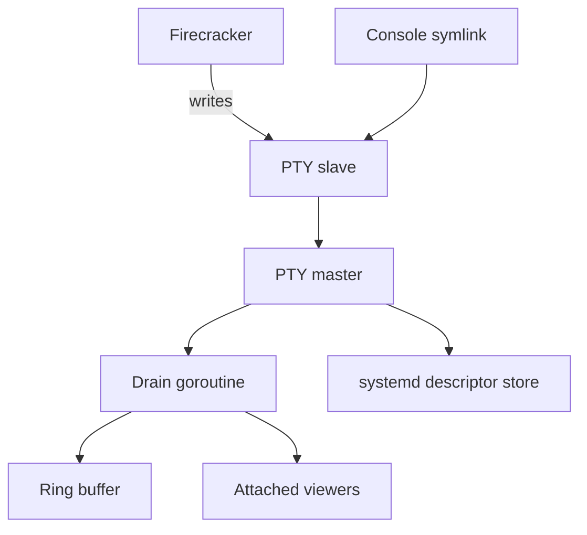

# console: VM serial consoles

For Go code, follow the repository [Go anti-pattern rules](../../../llm/go-code-review-guide.md).

[Metal specification](../../SPEC.md) · overview: [Metal daemon and API](../../../docs/region/metald.md)

## Purpose

The `console` package accepts VM serial output at all times, keeps the recent part, and replays it to each new viewer. SSH sessions on the same endpoint go to `vm.Manager.ConnectSSH`, not this package.

## Types

| Type | Responsibility |
|---|---|
| `SerialBroker` | Maps each running VM ID to its console. |
| `DescriptorStore` | Keeps PTY masters open across a metald restart. |
| `console` | Owns one PTY master, its scrollback, and its viewers. |
| `ringBuffer` | Holds recent output for replay. |
| `Winsize` | Carries a viewer terminal size. |

## PTY model

| Method | Action |
|---|---|
| `Open` | Allocates the master and starts the drain. Keeps it out of the store. |
| `Persist` | Adds the master to the store after the unit holds the slave. |
| `Attach` | Adds a viewer. |
| `Close` | Releases the master. |
| `Shutdown` | Releases local masters. |
| `Adopt` | Restores stored masters, removes stale masters and links. |

Do not close a master while its VM runs. Linux then sends SIGHUP to Firecracker and stops the VM.

- The unit needs `NotifyAccess`, `FileDescriptorStoreMax`, and `FileDescriptorStorePreserve=yes`.
- systemd closes a stored master that reports `EPOLLHUP`, which happens while no slave is open.
- A master is non-blocking. One drain at a time reads a PTY.
- The drain treats EIO as idle until the console is closed.

## Backpressure

- Output must never block the guest.
- A viewer that would block is dropped and disconnected.
- A new viewer gets the bounded scrollback first, then live output.

## Lifecycle

A console lives from VM launch to VM stop. The runtime calls `Open`, `Persist`, and `Close`. metald calls `Adopt` and `Shutdown`.

## Related

- [Metal daemon and API](../../../docs/region/metald.md) documents the console WebSocket endpoint.
- [Firecracker VM runtime](../../../docs/compute/runtime.md#limits-and-recovery) describes console survival across restarts.
- [internal/api/SPEC.md](../api/SPEC.md) owns the WebSocket framing and resize messages.
- [internal/firecracker/SPEC.md](../firecracker/SPEC.md) opens and closes a console with the VM.
