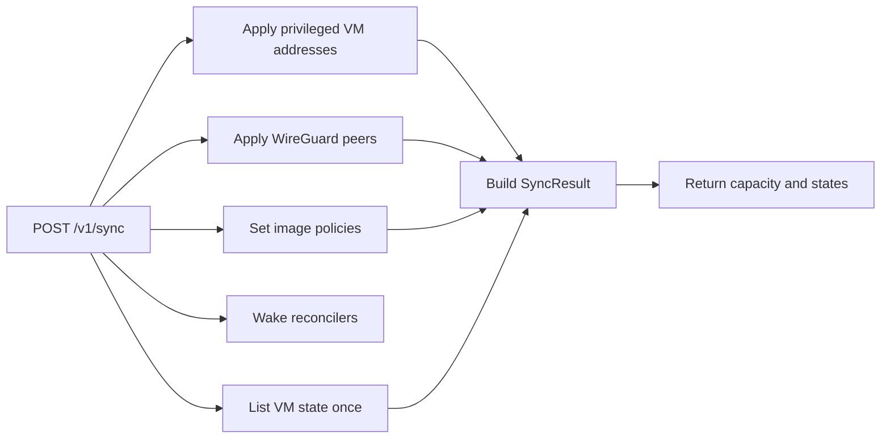

# host: controller synchronization and capacity

For Go code, follow the repository [Go anti-pattern rules](../../../llm/go-code-review-guide.md).

[internal SPEC](../SPEC.md) · overview: [docs/architecture.md](../../docs/architecture.md)

## Purpose

The controller owns some host state directly: WireGuard peers, image policies, and the privileged virtual machine address set. The `host` package is the one place that accepts those sets and applies them.

Each set arrives complete and replaces the previous one. The controller sends no incremental changes, so a lost message costs one sync interval, not a divergent host.

## Types

| Type | Responsibility |
|---|---|
| `Service` | Applies desired host state, then reports the sync result. |
| `DesiredState` | The 3 controller-owned sets, each complete. |
| `SyncResult` | What one sync returns: capacity and VM states. |
| `Capacity` | What the controller needs to place the next VM. |
| `PrivilegedMesh`, `WireGuardManager`, `ImagePolicyStore`, `VirtualMachineSource`, `StorageCapacitySource` | The services a sync calls out to. |

`Service` holds no state of its own. Each named service owns the state it applies, and `metald` supplies them at startup. The mesh service is absent when Atlas WG Mesh is disabled.

## Synchronize

The steps run in order and stop at the first error, so a failed step leaves the later sets untouched and the controller retries the whole sync. `Wake` follows the writes, so the reconciler acts on the new policies at once instead of at its next tick.

## Capacity

CPU is reported in millicores against entitlements, not against host load. Total CPU is the host CPU count multiplied by 1000. Available CPU is the total minus the `cpu_millicores` values that existing VMs reserve, and it never goes below zero. The host may therefore be busy while CPU still reads as available. The report is for visibility only. CPU is oversubscribed, so no admission check uses it and available CPU can read as zero while the host accepts more VMs.

Memory and storage are read from the host instead. Available memory comes from `MemAvailable` in `/proc/meminfo`, which counts cache the kernel can reclaim. Free memory alone would understate what a new guest can use.

A VM that is created or destroyed now holds one record for a short time. `VirtualMachineSource` skips it, so capacity reports the VMs that have both records instead of failing the sync.

## Virtual machine states

`SyncResult.VirtualMachineStates` maps each VM identifier to its last observed state. The states come from the same `List` call that capacity uses, so the sync makes one read. `List` reads the stored observed record of each VM, which the reconciler writes. It does not inspect the runtime, so the state is as fresh as the last reconcile pass.

## Related

- [docs/architecture.md](../../docs/architecture.md) places the sync in the daemon.
- [internal/api/SPEC.md](../api/SPEC.md) owns the sync request and response shapes.
- [internal/network/SPEC.md](../network/SPEC.md) owns WireGuard peers and the privileged mesh.
- [internal/storage/SPEC.md](../storage/SPEC.md) owns image policies and pool capacity.
