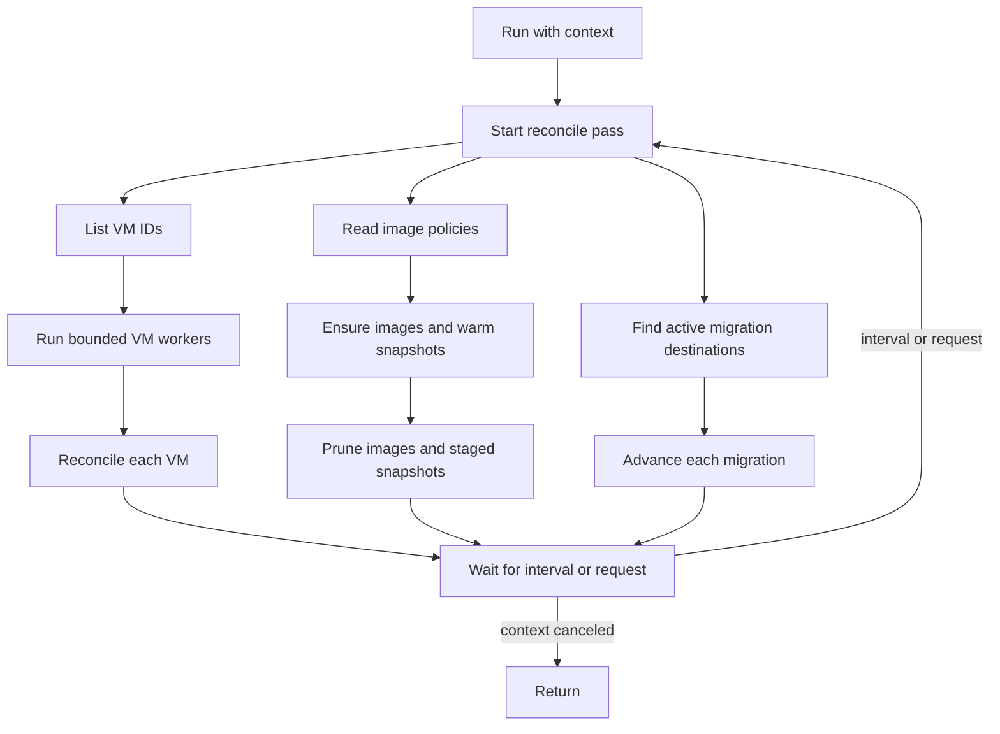

# reconciler: convergence loops

For Go code, follow the repository [Go anti-pattern rules](../../../llm/go-code-review-guide.md).

[internal SPEC](../SPEC.md) · overview: [docs/architecture.md](../../docs/architecture.md)

## Purpose

This package schedules convergence work. It owns no VM, image, snapshot, or traffic state.

## Types

| Type | Responsibility |
|---|---|
| `VirtualMachineReconciler` | Runs VM reconciliation passes. |
| `ImageReconciler` | Caches selected images and prunes unused images and staged snapshots. |
| `MigrationReconciler` | Advances each active destination migration through its handshake. |
| `passScheduler` | Runs one pass at startup, on an interval, and after a nonblocking request. |

## Pass model

Each operation has its own timeout. The VM pass also limits concurrent operations. One slow VM cannot block all other VMs.

Errors are logged and a later pass retries safe operations. Errors are suppressed after context cancellation because they do not describe host health.

## Ownership

metald owns each reconciler goroutine and the context that stops it. The VM manager owns every state decision and per-VM lock. The daemon traffic listener handles packet events separately.

## Related

- [docs/architecture.md](../../docs/architecture.md) places the loops in the daemon.
- [internal/vm/SPEC.md](../vm/SPEC.md) owns VM reconciliation.
- [internal/storage/SPEC.md](../storage/SPEC.md) owns image caching and pruning.
