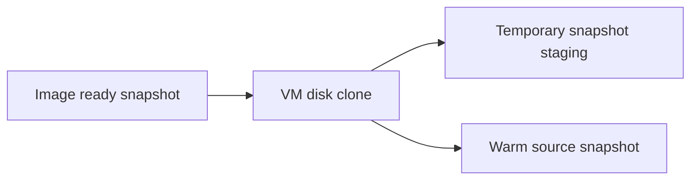

# storage: ZFS images and VM disks

For Go code, follow the repository [Go anti-pattern rules](../../../llm/go-code-review-guide.md).

[internal SPEC](../SPEC.md) · overview: [docs/storage.md](../../docs/storage.md)

## Purpose

Package `storage` imports images, creates fast virtual machine disk clones, manages warm artifacts, and stages machine image uploads.

## Types

| Type | State and responsibility |
|---|---|
| `ZFSPool` | Pool name, dataset names, device paths, and capacity. |
| `VirtualMachineStore` | VM disk preparation, usage, growth, and release. |
| `ImageStore` | Image directory, HTTP client, image locks, manifests, policy, pruning, and warm artifacts. |
| `SnapshotStore` | Snapshot directory, HTTP client, snapshot locks, staging, upload, deletion, and pruning. |
| `MigrationTransfer` | ZFS snapshot, estimate, mutual-TLS stream transport, resume token, GUID, and cleanup for a disk migration. |
| `Stores` | The four services created by `NewStores`. |

Consumers define the interfaces that they need. The storage package does not export one broad storage interface.

Files group behavior by resource, so changes to disks, images, or snapshots stay focused.

## Dataset layout

```text
ZFS
<pool>/images/<image>@ready       VM clone source
<pool>/vms/<vm-id>                VM disk
<pool>/staging/<snapshot-id>      read-only upload source
<pool>/warm/<key>@ready           warm boot disk

files
images/<image>/manifest.json
images/<image>/vmlinux
images/<image>/boot-args
images/<image>/last-used
images/<image>/warm/<key>/state
images/<image>/warm/<key>/memory
snapshots/<id>/metadata.json
snapshots/<id>/vmlinux
image-policies.json
```

## Clone and snapshot lineage



VM clones share image blocks. Staging clones share one fixed VM snapshot. Warm promotion uses ZFS send and receive for an independent warm disk.

## Image import

`EnsureImage` verifies the architecture, URLs, and SHA-256 values. An image reference cannot identify different content.

Metal downloads with bounded retries, creates a ZFS volume, copies the root file system, and creates `@ready`. It stores the kernel and manifest in the image directory.

## Provision flow

`PrepareBoot` ensures the image, links the kernel, clones the VM disk when absent, grows it when required, and creates the block node in the jailer chroot.

`PrepareRootFileSystem` performs disk preparation without the kernel link. `Release` removes the VM dataset and its snapshots. It promotes each dependent staging clone first, so a snapshot upload keeps its source when the VM goes away.

## Image policy

`SetImagePolicies` atomically replaces the policy file. The reconciler downloads retained images and prunes the rest after the idle period it sets: [internal/reconciler/SPEC.md](../reconciler/SPEC.md).

A successful VM start records image use. Metal keeps an image when a dependent VM clone prevents deletion.

## Snapshot and image operations

`Stage` creates a UUIDv7 value and stages a VM disk and kernel for the VM manager.

`StartUpload` checks the signed parts and starts an asynchronous upload. The part size is fixed, because the controller signs each part against it. The part count is an upper bound rather than an exact figure, because the artifact is stored compressed and its part count is known only once it is written. Uploads use a store-owned root context and wait group. Shutdown cancels new and active uploads and waits up to the daemon deadline.

Each artifact is stored compressed with zstd at its fastest level and one encoder thread. A VM disk is mostly unwritten blocks, so the stored object is a small fraction of the provisioned volume. One thread is deliberate: more threads did not compress faster in measurement, and the host runs customer VMs whose CPU this would take. `UploadedArtifact` reports `SizeBytes` for the uncompressed image and `StoredSizeBytes` for what the object store holds. The SHA-256 covers the uncompressed image, so one image keeps one digest whether it is stored raw or compressed.

Parts are cut from the compressed stream, so each one is buffered to a file in the snapshot directory before it is sent. No more than one part is held at a time, and the buffer is removed as soon as the part is stored. `StartUpload` removes buffers a crashed upload left behind.

Durable upload state lives in the staging metadata, including the parts the object store already holds and the multipart upload they belong to. An upload that restarts sends only the missing parts. A stored part is reused only when this pass produced the same length for it, because part boundaries come from the compressor; a part that differs is uploaded again over its part number. A different multipart upload ID discards the stored parts, so a replaced upload never reuses an ETag.

One part that the object store refuses is repeated up to three times before the artifact fails, and each attempt sends the part again from the start.

Live byte progress stays in memory and counts uncompressed bytes, which is the size the controller shows. An upload recorded as running with no goroutine behind it did not survive a restart, so `UploadStatus` reports it as pending and the controller starts it again.

A download detects the artifact format from its content. A zstd artifact begins with the frame magic `28 B5 2F FD` and a raw artifact does not, so the controller can serve either form with no agreement between the two. The digest covers the decoded bytes, so a wrong guess fails the download instead of writing a bad disk.

`DeleteSnapshot` cancels a running upload and waits for it to stop before it removes the data that upload is reading. It removes the staging clone before the source snapshot, because ZFS keeps a snapshot alive while a clone of it exists.

The prune pass keeps staging data while an upload goroutine uses it. The pass removes invalid staging metadata and reads the source snapshot from the ZFS clone.

## Migration transfer

`MigrationTransfer` copies one VM disk between hosts. The source snapshots `<pool>/vms/<vm-id>@<name>` and estimates the full or incremental stream. A one-shot mutual-TLS listener relays `zfs send` to the one destination that connects, in that direction only. The destination verifies the source WireGuard IP and pipes the received stream into `zfs recv -s`. The receive saves a resume token when it stops early. The destination compares the received snapshot GUID with the source GUID, so only a verified copy counts.

Non-streaming commands run through an injectable runner, so a focused test uses a fake. The streaming send and receive commands use `exec`, and the stream itself moves through a `crypto/tls` connection. A resume token is validated against the requested snapshot, so a token cannot read another dataset.

`AbortReceive` cancels an interrupted resumable receive and removes the destination dataset. An abort calls it before it removes the destination VM records. A missing dataset, or a dataset with no saved receive state, is not an error.

## Concurrency

Image imports and snapshot staging are serialized per resource, not per store. One lock covers an image reference, and one covers a snapshot ID, so unrelated images and snapshots proceed at the same time.

Every multi-step create attempts to remove what it made when a later step fails. An image, a staged snapshot, and a warm image are complete or absent when cleanup succeeds. Deletes accept an already absent resource, so a retry after a partial failure still succeeds.

## Warm artifacts

The warm key includes image identity, exact VM shape, and Firecracker compatibility. `ImageStore` keeps state, memory, and an independent warm disk snapshot.

Memory and Firecracker state never leave the host. Warm artifacts are not public VM restore points.

## Chroot materialization

Metal links the kernel into the jailer chroot and creates a block node for the VM volume. `LinkOrCopy` avoids a full memory-file copy when the filesystem supports links or reflinks.

## Related

- [docs/storage.md](../../docs/storage.md) gives the broad storage model.
- [internal/vm/SPEC.md](../vm/SPEC.md) coordinates VM operations.
- [docs/host-layout.md](../../docs/host-layout.md) lists files and datasets.
