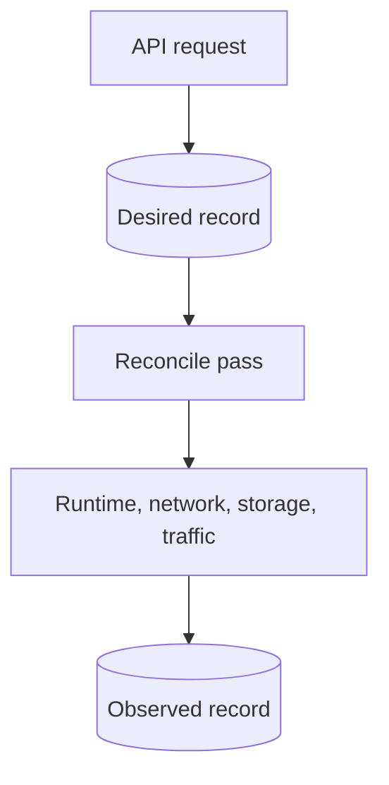

# vm: virtual machine manager

For Go code, follow the repository [Go anti-pattern rules](../../../llm/go-code-review-guide.md).

[Metal specification](../../SPEC.md) · overview: [Metal reconciliation](../../../docs/compute/reconciliation.md)

## Purpose

This package owns VM records, state transitions, and reconciliation. Host packages implement runtime, network, storage, and snapshot operations through small interfaces declared here.

## Request flow



- The desired generation rises only for a real desired change.
- The restart generation rises for each accepted restart.

## Records

```text
machines/<id>/config.json   desired state and specification
machines/<id>/status.json   observed state and operation progress
```

- The create fingerprint excludes signed image URLs.
- A firewall change increases the specification generation.
- `cpu_millicores` accepts 100 through 32000. Firecracker receives `ceil(cpu_millicores / 1000)` vCPUs.
- A `sleep_after_idle_seconds` change does not change `SpecificationGeneration`.
- The daemon validates every record at startup. It does not repair or remove an invalid record.

## Reconciliation

| Desired power state | Action |
| --- | --- |
| `running` | Start, resume, or restore. Stop after idle when configured. |
| `paused` | Start or restore, then pause. |
| `stopped` | Hard stop and delete saved state. |
| `destroyed` | Remove runtime, network, storage, and records. |

Idle behavior is in [Sleepy VMs](../../../docs/compute/sleepy-vms.md).

- A valid saved state is authoritative when Firecracker is stopped.
- A saved state beside a running Firecracker process is stale and is deleted.
- A restore failure keeps the saved state.
- A restart or machine shape change deletes the saved state.
- Traffic restore takes the per-VM lock. A stale or duplicate event has no effect.
- The phase and operation ID are written before each host call.
- Destroy records progress per resource, so an interrupted destroy resumes.

## Migration

The migration lifecycle lives in [internal/vm/migration/SPEC.md](migration/SPEC.md). This package does not import that package.

- The daemon injects a `MigrationGuard` with `SetMigrationGuard`.
- Without a guard, no VM is migrating.

## Boundaries

- Host packages implement `Runtime`, `Network`, `Storage`, and `Snapshots`.
- The daemon traffic listener passes each `traffic.Event` to `Manager.RestoreAfterTraffic`.
- `WarmImageBuilder` creates shared start artifacts. It does not use the saved state of an idle VM.

## Related

- [internal/firecracker/SPEC.md](../firecracker/SPEC.md) implements `Runtime`.
- [internal/storage/SPEC.md](../storage/SPEC.md) implements `Storage` and `Snapshots`.
- [internal/network/SPEC.md](../network/SPEC.md) implements `Network` and owns packet tracking.
- [internal/reconciler/SPEC.md](../reconciler/SPEC.md) drives reconciliation.
