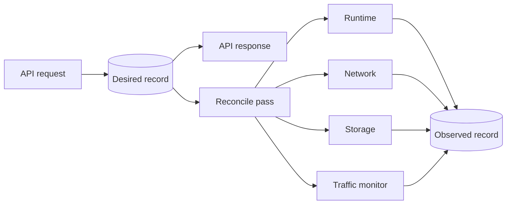
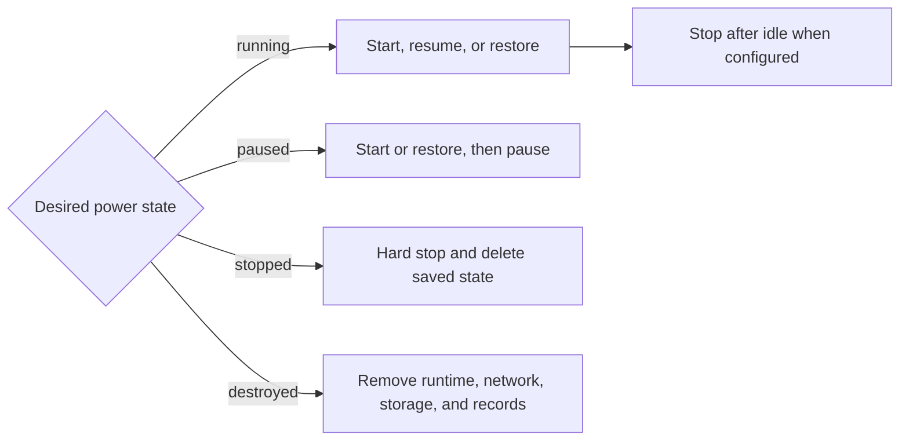

# vm: virtual machine manager

For Go code, follow the repository [Go anti-pattern rules](../../../llm/go-code-review-guide.md).

[internal SPEC](../SPEC.md) · overview: [docs/vm.md](../../docs/vm.md)

## Purpose

This package owns VM records, state transitions, and reconciliation. Host packages implement runtime, network, storage, and snapshot operations through small interfaces declared here. The manager uses `traffic.Monitor` directly.

## Request flow



The controller polls until observed generations match desired generations. The desired generation rises only for a real desired change. The restart generation rises for each accepted restart.

## Records

```text
machines/<id>/config.json   desired state and specification
machines/<id>/status.json   observed state and operation progress
```

The create fingerprint identifies one reservation request. It includes `sleep_after_idle_seconds` and excludes signed image URLs.

The desired network includes the complete firewall configuration. A firewall change increases the specification generation and the normal reconcile pass applies it.

`cpu_millicores` is the CPU entitlement. `1000` millicores equals one CPU core. The API accepts 100 through 32000 millicores. The lower limit prevents impractical VM CPU quotas. The upper limit follows Firecracker's maximum of 32 guest vCPUs. Firecracker receives `ceil(cpu_millicores / 1000)` guest vCPUs, and systemd enforces the exact millicore entitlement.

`sleep_after_idle_seconds` is compute configuration. `0` disables automatic idle shutdown. A timeout-only update does not change `SpecificationGeneration` because it does not change the Firecracker machine shape.

The daemon validates every record at startup. It does not repair or remove an invalid record.

## Reconciliation



The manager checks traffic only after normal running reconciliation completes. It starts event observation before the final sample. A sample error before state creation keeps the VM running. New traffic or a sample error after state creation restores the VM.

An automatically stopped VM keeps desired state `running` and reports observed state `stopped`. New traffic enters the same per-VM lock, validates the destination and runtime, and restores the saved state. A stale or duplicate event has no effect.

A positive timeout can change while the VM stays stopped. A change to `0` restores it. A restart or machine shape change deletes the saved state and uses a normal start.

A valid saved state is authoritative when Firecracker is stopped. Restore failure keeps the saved state. Invalid state is an operation failure. A saved state beside a running Firecracker process is stale and is deleted.

The phase and operation ID are written before each host call. A failure stores a safe public message and local detail. Destroy records progress per resource so an interrupted destroy resumes safely.

## Migration

The migration lifecycle lives in [internal/vm/migration/SPEC.md](migration/SPEC.md). This package supports migration without importing that package.

The manager exposes the operations migration needs: VM records, ID allocation, locks, storage release, and migration runtime and network operations. These operations stop the source, create the destination network, apply state with a cold start, remove the destination runtime, and limit or refresh the source disk.

The manager reads migration lock state through an injected `MigrationGuard`. A source lock blocks VM changes and reconciliation. A destination reservation hides the VM from get and list and pauses reconciliation. Without a guard, no VM is migrating. The daemon injects the guard with `SetMigrationGuard`.

## Boundaries

`Runtime`, `Network`, `Storage`, and `Snapshots` are consumed here and implemented by host packages. The manager uses `traffic.Monitor` for samples and watch operations. The daemon traffic listener passes each `traffic.Event` to `Manager.RestoreAfterTraffic`.

`WarmImageBuilder` creates shared start artifacts. It does not use the saved state of an idle VM.

## Related

- [internal/firecracker/SPEC.md](../firecracker/SPEC.md) implements `Runtime`.
- [internal/storage/SPEC.md](../storage/SPEC.md) implements `Storage` and `Snapshots`.
- [internal/network/SPEC.md](../network/SPEC.md) implements `Network`.
- [internal/network/traffic/SPEC.md](../network/traffic/SPEC.md) owns packet tracking.
- [internal/reconciler/SPEC.md](../reconciler/SPEC.md) drives reconciliation and traffic events.
- [internal/vm/migration/SPEC.md](migration/SPEC.md) owns the migration lifecycle this package supports.
