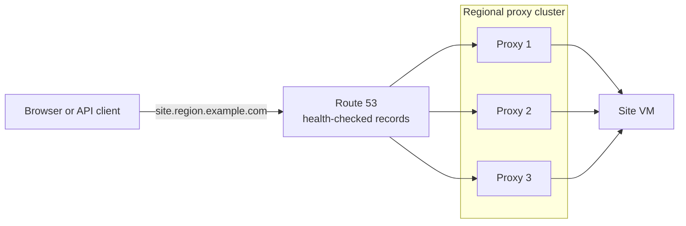
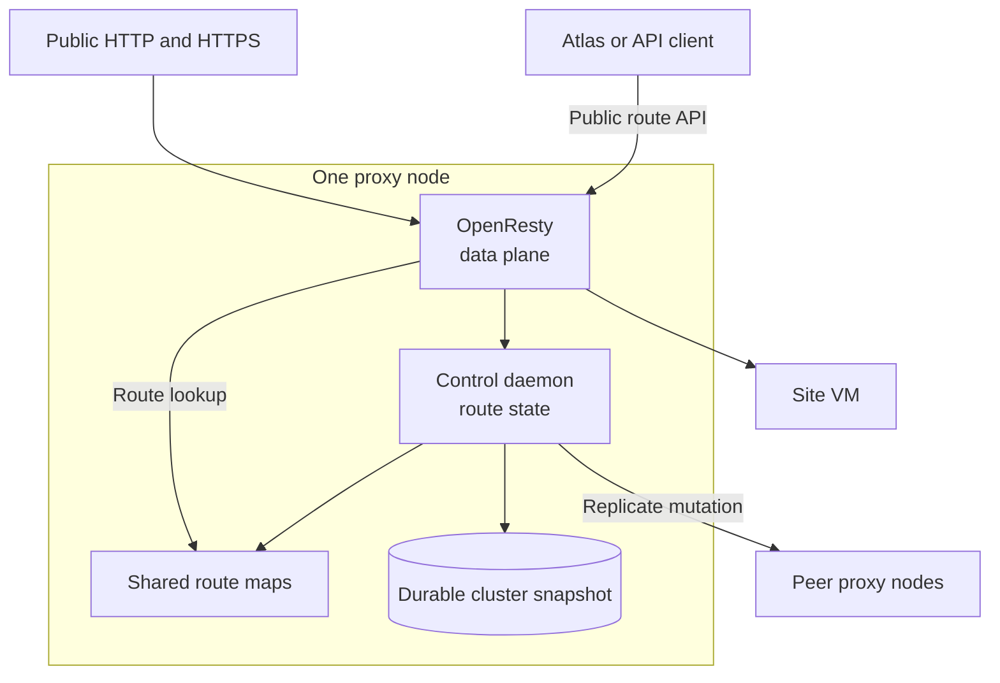
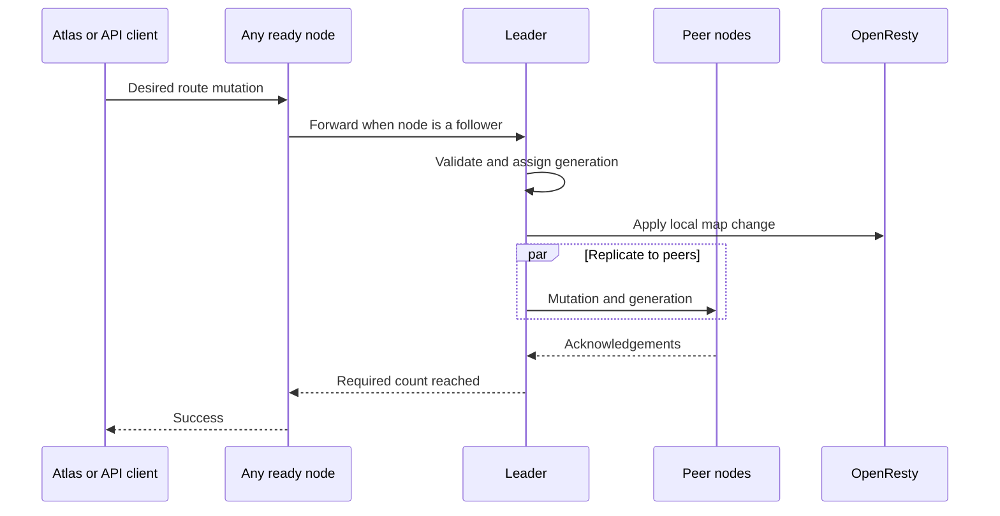

# Atlas HTTP proxy

The Atlas HTTP proxy routes public HTTP and HTTPS traffic to VMs in one region. A regional cluster has 1 to 5 proxy nodes.

Every ready node serves traffic. The nodes replicate one ordered route state for sites and custom domains.

## Start here



Read these guides in order:

1. [Install](docs/setup.md) explains the services and host requirements.
2. [Configuration](docs/configuration.md) explains certificates, peers, authentication, and DNS.
3. [High availability](docs/high-availability.md) explains leader election and route replication.
4. [Control daemon](docs/control-daemon.md) defines the route API.
5. [OpenResty data plane](docs/openresty.md) traces public traffic to a VM.

## Why the proxy has 2 layers

OpenResty handles public traffic. The control daemon validates route changes and replicates them to peer nodes.



This split keeps the traffic path small. It also keeps route validation and cluster state outside OpenResty workers.

## Addresses

| Address | Purpose |
| --- | --- |
| `proxy.<wildcard-domain>` | Regional API address with health-checked records for ready nodes |
| `proxy-NNN.<wildcard-domain>` | Stable address for one node and peer communication |
| `*.<wildcard-domain>` | Wildcard route for site and auto-proxy traffic |

Atlas manages these records and the regional wildcard certificate.

## How a route change works

A client can send a mutation to any ready node. A follower forwards the mutation to the current leader.



All mutation types are idempotent. Send the same desired mutation again after an uncertain `503` response.

## What each node stores

Each node stores the site map, domain map, election term, vote, operation ID, and generation. The node writes this state to `/var/lib/nginx/cluster-state.json`.

A new node asks peers for status. It installs the snapshot with the highest generation before it becomes ready.

## Install locally

```sh
sudo ./nginx/setup.sh
```

The script installs OpenResty and the control daemon. Atlas must send a complete configuration before the node becomes ready.

For development, install the Python package and run the control tests:

```sh
python3 -m venv .venv
. .venv/bin/activate
python -m pip install --editable 'control[test]'
python -m pytest -q control/tests
```

Use the [development guide](docs/development.md) for the complete checks and code map.

## Component paths

| Path | Purpose |
| --- | --- |
| `nginx/` | OpenResty configuration, Lua code, setup, and systemd units |
| `control/proxy_control/` | Control API, cluster state, leader election, and replication |
| `control/tests/` | Control daemon unit tests |
| `tests/` | OpenResty data-plane tests |
| `docs/` | Operator and developer guides |

Atlas HTTP proxy uses the [AGPL-3.0 license](../../license.txt).
