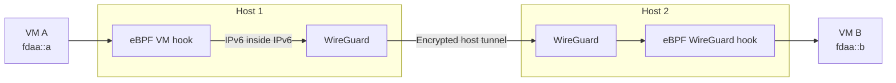
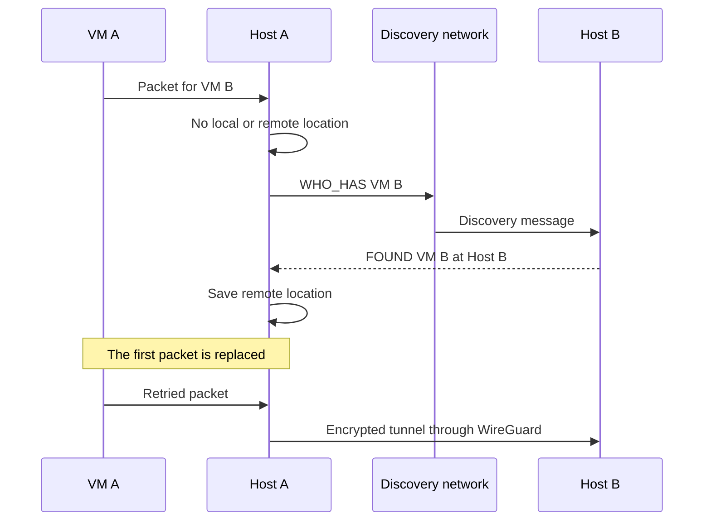

# Atlas WG Mesh

Atlas WG Mesh gives each VM a stable private IPv6 address. The address does not change when the VM moves to another host.

The mesh uses eBPF for packet decisions, WireGuard for encryption, and discovery messages to find the host that owns a VM.

## Start with one packet

The eBPF hook on Host 1 finds the owner of VM B. It adds an outer IPv6 header with the WireGuard address of Host 2.

WireGuard encrypts the host-to-host packet. The hook on Host 2 removes the outer header and sends the original packet to VM B.

## How a host finds a VM

A host keeps local ownership and learned remote locations in eBPF maps. It sends `WHO_HAS` when the destination is not known.

TCP normally retries the first packet after discovery. The per-VM rate limit controls discovery traffic.

## Why the mesh has no central route lookup

The packet path continues when Atlas is unavailable. Each host can learn a VM location directly from the trusted regional network.

This design also makes planned VM moves fast. The new host sends `NOW_HERE`, and hosts update an existing learned route.

## Security boundary

| Boundary | Rule |
| --- | --- |
| VM identity | A source address must match the address registered on the VM interface. |
| Host addresses | VMs cannot reach the `fdab::/16` WireGuard host range through the mesh. |
| Tenant isolation | Different nonzero tenants cannot communicate. |
| Privileged VMs | Only controller-approved tenant `0` addresses can cross tenant boundaries. |
| Discovery | The discovery network must contain trusted hosts. Discovery messages are not authenticated. |
| Host traffic | WireGuard encrypts traffic only between configured peers. |

::: warning Trusted network required
Use multicast discovery only on a trusted Layer-2 network. Use the unicast relay when multicast is unavailable.
:::

## Scope and limits

WG Mesh owns private traffic between VM addresses in one region. It does not configure WireGuard peers, keys, NAT, DNS, DHCP, or host firewall rules.

WG Mesh does not provide private traffic between regions.

## Choose the next guide

| Need | Guide |
| --- | --- |
| Install a host or manage VM ownership | [Operations](docs/operations.md) |
| Trace every packet and recovery scenario | [Design and packet flow](docs/design.md) |
| Use a network without multicast | [Unicast discovery](docs/unicast-network.md) |
| Inspect routes and packet decisions | [Debug in production](docs/debug-in-production.md) |
| Review measured throughput and packet rate | [Benchmarks](docs/benchmark.md) |

For Go changes, use the repository [Go review guide](../../llm/go-code-review-guide.md).

Atlas WG Mesh uses the [AGPL-3.0 license](../../license.txt).
