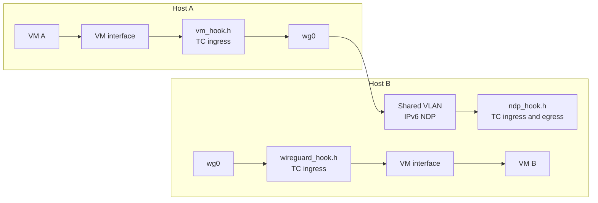
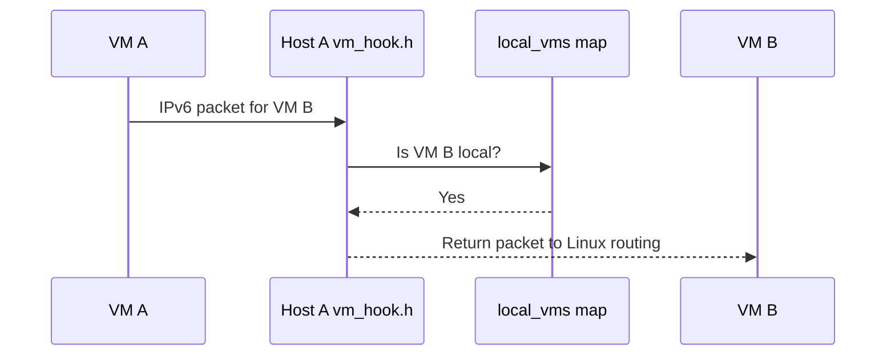
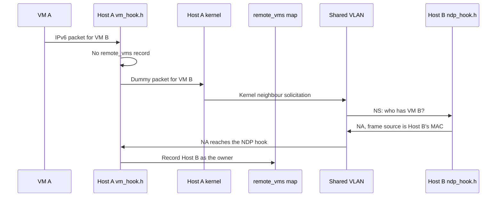
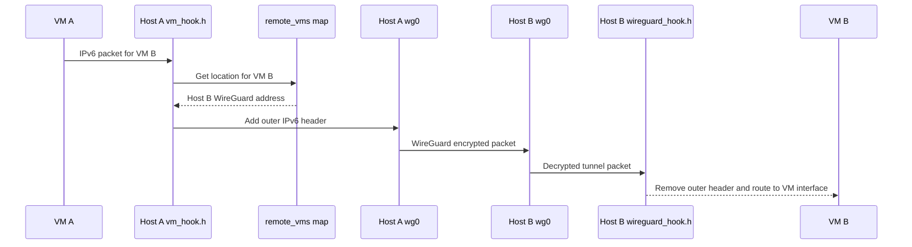
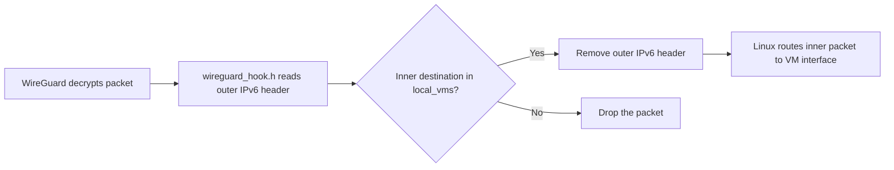

# Atlas WG Mesh design

For Go code, follow the repository [Go anti-pattern rules](../../../llm/go-code-review-guide.md).

This document explains packet paths, BPF state, and recovery behavior. Read the [operations guide](operations.md) for setup.

## Contents

- [Atlas WG Mesh design](#atlas-wg-mesh-design)
  - [Contents](#contents)
  - [Addressing and state](#addressing-and-state)
  - [Discovery with NDP](#discovery-with-ndp)
  - [Trust model](#trust-model)
  - [BPF interface](#bpf-interface)
  - [System view](#system-view)
  - [Scenario 1: local VM delivery](#scenario-1-local-vm-delivery)
  - [Scenario 2: first packet to a remote VM](#scenario-2-first-packet-to-a-remote-vm)
  - [Scenario 3: known remote VM](#scenario-3-known-remote-vm)
  - [Scenario 4: receive an Atlas WG Mesh tunnel](#scenario-4-receive-an-atlas-wg-mesh-tunnel)
  - [Scenario 5: VM move](#scenario-5-vm-move)
  - [Scenario 6: unreachable owner](#scenario-6-unreachable-owner)
  - [Code map](#code-map)

## Addressing and state

Each host has a WireGuard address in `fdab::/16`. Each VM has an address in `fdaa::/16`.

```text
Bytes:  0  1 |  2  3 |  4  5  6  7 |  8  9 10 11 12 13 14 15
Field: fd aa | region |    tenant   |          VM ID
```

The data path uses the tenant field. Region and VM ID fields are available to provisioning.

Atlas WG Mesh owns traffic between VM addresses. A source address must be registered on the ingress VM interface, and VMs cannot reach host WireGuard addresses in `fdab::/16`. Linux owns other host traffic. WireGuard encrypts host-to-host traffic. Atlas WG Mesh does not configure WireGuard, NAT, DNS, DHCP, or firewall rules.

## Discovery with NDP

VM locations are learned with IPv6 neighbour discovery on the shared VLAN. There is no Atlas discovery daemon and no Atlas discovery protocol.

The host configuration installs one route for the VM range through the shared VLAN interface:

```text
fdaa::/16 dev <vlan>
```

Route lookup for a remote VM destination therefore selects the VLAN, and Linux runs NDP on that link. A more specific host route on the VM interface delivers traffic for local VMs.

When a VM is registered, the CLI adds a proxy NDP entry for the VM address on the VLAN interface. The host then answers neighbour solicitations for the VM with a neighbour advertisement. No Atlas NDP option exists: every host already knows every peer from the WireGuard peer state, so the frame source MAC of an advertisement identifies the answering host.

The NDP hook on the VLAN ingress path maps that MAC to the peer's WireGuard address through `peers_by_mac` and records the location in `remote_vms`.

The VM hook looks the destination up in `remote_vms`. A miss hands a bare dummy packet to the host stack, and the kernel resolves the destination with its own neighbour solicitation. The dummy carries no payload, so nothing leaks when the kernel transmits it after resolution.

The CLI is a lifecycle and configuration tool only. It never monitors neighbour state and it never configures WireGuard.

## Trust model

VMs use `fdaa::/16`; host WireGuard addresses use `fdab::/16`. The VM hook drops traffic to `fdab::/16`, so VMs cannot reach the host subnet through Atlas WG Mesh.

Nonzero tenant IDs are isolated from each other. Cross-tenant traffic is permitted only when either endpoint is a privileged tenant-`0` VM whose full IPv6 address is in the controller-managed whitelist. This allows request and response traffic while preventing access to every other tenant-`0` VM.

Neighbour advertisements are not authenticated, so a host with access to the shared VLAN can influence learned VM locations. Restrict the VLAN to trusted participating hosts. WireGuard encrypts traffic only to configured peers.

## BPF interface

| Hook | Program | Purpose |
| --- | --- | -- |
| VM interface | `handle_vm_packet` | Route local traffic, encapsulate remote traffic. |
| Shared VLAN interface | `handle_ndp_packet` | Learn locations from incoming advertisements, register neighbours. |
| Shared VLAN interface | `handle_ndp_unicast_egress` | Unicast mode, attached instead of `handle_ndp_packet`: wrap solicitation and advertisement packets in IPv4, and send them to peers. |
| Shared VLAN interface | `handle_ndp_unicast_ingress` | Unicast mode, attached instead of `handle_ndp_packet`: validate the peer, learn requester, owner, and neighbour, remove the outer IPv4 header. |
| WireGuard interface | `handle_wireguard_packet` | Remove tunnel headers for local VMs, answer tunnels for other VMs with NOT_HERE, and drop stale locations on received NOT_HERE. |

The VLAN hook is attached to TC ingress only, because an advertisement needs no changes on the way out.

| Map | Purpose |
| --- | --- |
| `config` | Host configuration, including this host's WireGuard address. |
| `local_vms` | Local VM ownership. |
| `peer_list`, `peers_by_mac` | The peer set from the WireGuard peer state: one dense array with IPv4, MAC, and WireGuard address per peer, and a MAC index for identification. |
| `remote_vms` | Learned remote VM locations. |
| `ndp_requesters` | Unicast mode: peers waiting for an answer. |
| `privileged_tenant_allowed_addresses` | Privileged-tenant VM addresses permitted to communicate across tenants. |
| `debug_config`, `debug_stats`, `debug_events` | Optional debug state and events. |
| `build_hash` | Installed BPF object hash. |

## System view



The VM hook processes a packet from a VM interface. The WireGuard hook processes a packet after WireGuard decrypts it. The NDP hook processes neighbour solicitation and advertisement packets on the shared VLAN.

## Scenario 1: local VM delivery

This path applies when both VMs are connected to the same host.



`vm_hook.h` returns `TC_ACT_OK`. Linux uses the host route for VM B and sends the packet to the destination interface. Atlas WG Mesh adds no tunnel header.

## Scenario 2: first packet to a remote VM

This path applies when the host has no location for the destination.



The first packet itself is replaced by the solicitation, so the guest retransmits it. Every later packet uses Scenario 3.

## Scenario 3: known remote VM

This path applies when `remote_vms` has a location for the destination.



The outer IPv6 destination is the WireGuard address of Host B. The inner IPv6 packet stays unchanged.

## Scenario 4: receive an Atlas WG Mesh tunnel

This path applies after a remote host sends an Atlas WG Mesh IPv6-in-IPv6 tunnel.



The destination host never forwards an Atlas WG Mesh tunnel to another host. It either delivers the inner packet locally or answers with NOT_HERE, so the sender drops its stale location and discovers the VM again.

## Scenario 5: VM move

Use this path for a stopped VM. Remove the VM on the old host and add it on the new host before you start the guest.

```text
Host B: vm remove removes the /128 route and the proxy NDP entry.
Host C: vm add adds the /128 route and the proxy NDP entry.
```

The first packet from any sender reaches the old host, which answers with NOT_HERE. The sender drops its location, and its next packet discovers Host C, whose advertisement carries Host C's frame source MAC. No Atlas message and no WireGuard change are required.

## Scenario 6: unreachable owner

A host that fails takes its VMs with it, so senders hold locations that no longer answer. When the host returns without a VM, or the VM moved while the host was down, the first packet to the old host returns NOT_HERE and the sender discovers the VM again. A sender can also clear a location at once:

```sh
atlas-wg-mesh debug inspect --address fdaa:1:0:2::20
```

## Unicast NDP transport

Hosts without a shared Layer-2 VLAN use the [unicast mode](unicast-network.md). The same NDP packets travel inside an outer IPv4 header between configured peers, so Linux neighbour discovery, proxy NDP, and the WireGuard datapath stay unchanged.

The unicast hooks and `handle_ndp_packet` never run together. A host runs either the multicast NDP hook on the uplink, or the two unicast hooks, never both. The `unicast start` daemon owns the choice: it attaches the unicast hooks and removes the multicast filter, and a clean stop reverses the swap.

The egress unicast hook owns the whole advertisement path. For a solicitation, it wraps the packet in IPv4 and sends one clone per peer with `bpf_clone_redirect`, which is copy on write. For an answer, it wraps the packet and returns it to the requester recorded in `ndp_requesters`.

The ingress unicast hook owns the whole learning path. It accepts a wrapped packet only from a configured peer, records the requester from the outer IPv4 source, removes the outer header, and restores the Ethernet type. For an answer, it records the location in `remote_vms` from the frame source MAC, exactly as in multicast mode.

A solicitation always fans out to every peer, and only the owner answers. Discovery is rare, because NOT_HERE triggers it only after a location turns stale.

The peer state comes from `wireguard-peers.json`, which metald writes and `peers sync` loads into the BPF maps. The daemon processes no packets. A start or stop passes through a short window where both hook sets are attached; that window is safe, because the unicast hooks skip work that the multicast hook already did and every learning step is an idempotent replacement.

## Location recovery

A location in `remote_vms` lives until the host that advertised it contradicts it. When a host receives a tunnel for a VM it does not own, its WireGuard hook answers with NOT_HERE: a control message that travels back through WireGuard to the sender. The sender accepts NOT_HERE only from the host its cache holds, so no peer can evict another peer's advertisement. The sender then drops the location, and its next packet triggers discovery again.

NOT_HERE travels as a bare IPv6 packet with the experimental next header 253 inside the WireGuard tunnel, so it needs no checksum and no listeners.

## Code map

| File | Main responsibility |
| --- | --- |
| `bpf/bpf.c` | Build one BPF object from all source fragments. |
| `bpf/vm_hook.h` | Process packets from VM interfaces. |
| `bpf/ndp_hook.h` | Process NDP packets on the shared VLAN interface. |
| `bpf/ndp_unicast_hook.h` | Transport NDP packets over a routed IPv4 underlay. |
| `bpf/wireguard_hook.h` | Process Atlas WG Mesh tunnels and NOT_HERE recovery. |
| `bpf/state.h` | Define host and VM BPF state. |
| `bpf/debug.h` | Define debug maps and event helpers. |
| `bpf/protocol.h` | Define on-wire values and structures. |
| `bpf/address.h` | Define VM address helpers. |
